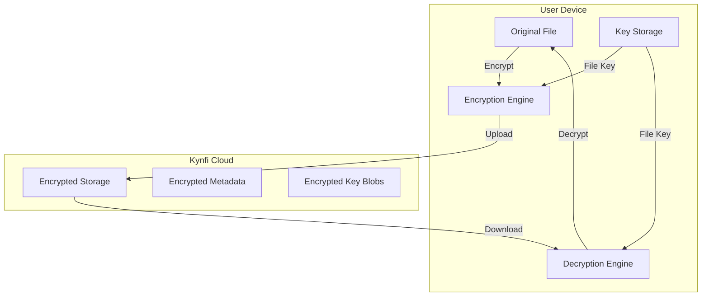
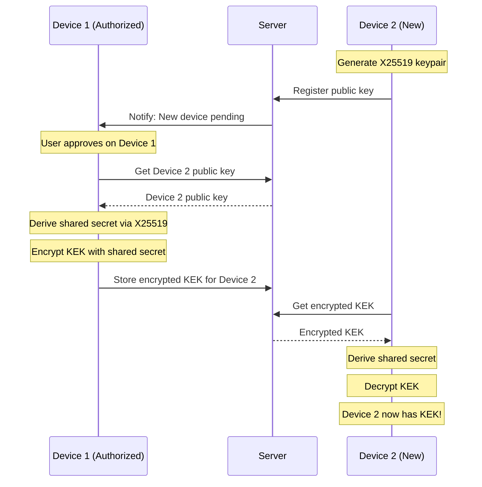

# End-to-End Encryption (E2EE) for Kynfi

## Overview

End-to-end encryption ensures that:
- **Only the user** can decrypt their files
- **Kynfi servers** cannot read file contents
- **Files are encrypted** before leaving the device
- **Keys never leave** the user's devices

## Encryption Architecture



## Key Hierarchy

```
Master Password (user-memorized)
    │
    ▼
┌─────────────────────────────────────┐
│  Key Derivation (Argon2id)          │
│  - Salt: random, stored in cloud    │
│  - Memory: 64MB                     │
│  - Iterations: 3                    │
│  - Output: 256-bit Master Key       │
└─────────────────────────────────────┘
    │
    ▼
┌─────────────────────────────────────┐
│  Master Key (256-bit)               │
│  - Never leaves device              │
│  - Derived from password            │
│  - Used to encrypt/decrypt KEK      │
└─────────────────────────────────────┘
    │
    ▼
┌─────────────────────────────────────┐
│  Key Encryption Key (KEK)           │
│  - Random 256-bit key               │
│  - Encrypted with Master Key        │
│  - Stored in cloud (encrypted)      │
│  - Used to encrypt file keys        │
└─────────────────────────────────────┘
    │
    ▼
┌─────────────────────────────────────┐
│  File Keys (per-file)               │
│  - Random 256-bit key per file      │
│  - Encrypted with KEK               │
│  - Stored alongside file metadata   │
└─────────────────────────────────────┘
```

## Cryptographic Algorithms

| Purpose | Algorithm | Key Size | Notes |
|---------|-----------|----------|-------|
| **Password Derivation** | Argon2id | 256-bit output | Memory-hard, GPU-resistant |
| **File Encryption** | XChaCha20-Poly1305 | 256-bit | AEAD, large nonce |
| **Key Wrapping** | AES-256-GCM | 256-bit | For encrypting keys |
| **Hashing** | BLAKE3 | 256-bit | Fast, secure |
| **Key Exchange** | X25519 | 256-bit | For device pairing |

### Why These Choices?

- **Argon2id**: Winner of Password Hashing Competition, resistant to GPU/ASIC attacks
- **XChaCha20-Poly1305**: Fast in software, 192-bit nonce prevents reuse issues
- **BLAKE3**: Extremely fast hashing for file integrity
- **X25519**: Modern elliptic curve for secure key exchange

## Database Schema

```sql
-- User encryption settings
CREATE TABLE user_encryption (
  user_id UUID PRIMARY KEY REFERENCES profiles(id) ON DELETE CASCADE,
  
  -- Key derivation parameters
  kdf_salt BYTEA NOT NULL,           -- Random salt for Argon2id
  kdf_memory INT DEFAULT 65536,      -- Memory in KB (64MB)
  kdf_iterations INT DEFAULT 3,
  kdf_parallelism INT DEFAULT 4,
  
  -- Encrypted Key Encryption Key
  encrypted_kek BYTEA NOT NULL,      -- KEK encrypted with Master Key
  kek_nonce BYTEA NOT NULL,          -- Nonce for KEK encryption
  
  -- Recovery
  recovery_key_hash TEXT,            -- Hash of recovery key (for verification)
  recovery_kek BYTEA,                -- KEK encrypted with recovery key
  recovery_nonce BYTEA,
  
  -- Settings
  encryption_enabled BOOLEAN DEFAULT FALSE,
  encryption_version INT DEFAULT 1,
  
  created_at TIMESTAMPTZ DEFAULT NOW(),
  updated_at TIMESTAMPTZ DEFAULT NOW()
);

-- Per-file encryption metadata
ALTER TABLE files ADD COLUMN encrypted BOOLEAN DEFAULT FALSE;
ALTER TABLE files ADD COLUMN encrypted_key BYTEA;      -- File key encrypted with KEK
ALTER TABLE files ADD COLUMN key_nonce BYTEA;          -- Nonce for file key encryption
ALTER TABLE files ADD COLUMN file_nonce BYTEA;         -- Nonce for file content encryption
ALTER TABLE files ADD COLUMN encryption_version INT;

-- Device keys for multi-device sync
CREATE TABLE device_keys (
  id UUID PRIMARY KEY DEFAULT gen_random_uuid(),
  user_id UUID REFERENCES profiles(id) ON DELETE CASCADE,
  device_id UUID REFERENCES sync_devices(id) ON DELETE CASCADE,
  
  -- Device's public key for key exchange
  public_key BYTEA NOT NULL,
  
  -- KEK encrypted for this device (using device's key)
  encrypted_kek BYTEA NOT NULL,
  kek_nonce BYTEA NOT NULL,
  
  -- Metadata
  device_name TEXT,
  authorized_at TIMESTAMPTZ DEFAULT NOW(),
  last_used_at TIMESTAMPTZ,
  
  UNIQUE(user_id, device_id)
);
```

## Encryption Package

```typescript
// packages/crypto/src/index.ts

export { CryptoEngine } from './engine';
export { KeyManager } from './keys';
export { FileEncryptor } from './file-encryptor';
export { StreamEncryptor } from './stream-encryptor';
export * from './types';
```

### Key Manager

```typescript
// packages/crypto/src/keys.ts

import { argon2id } from '@noble/hashes/argon2';
import { xchacha20poly1305 } from '@noble/ciphers/chacha';
import { randomBytes } from '@noble/hashes/utils';

export class KeyManager {
  private masterKey: Uint8Array | null = null;
  private kek: Uint8Array | null = null;
  
  /**
   * Derive master key from password
   */
  async deriveKey(
    password: string,
    salt: Uint8Array,
    params: KDFParams
  ): Promise<Uint8Array> {
    return argon2id(
      new TextEncoder().encode(password),
      salt,
      {
        t: params.iterations,
        m: params.memory,
        p: params.parallelism,
        dkLen: 32, // 256 bits
      }
    );
  }
  
  /**
   * Initialize encryption for a new user
   */
  async setupEncryption(password: string): Promise<EncryptionSetup> {
    // Generate random salt
    const salt = randomBytes(32);
    
    // Derive master key from password
    const masterKey = await this.deriveKey(password, salt, DEFAULT_KDF_PARAMS);
    
    // Generate random KEK
    const kek = randomBytes(32);
    
    // Encrypt KEK with master key
    const kekNonce = randomBytes(24);
    const cipher = xchacha20poly1305(masterKey, kekNonce);
    const encryptedKek = cipher.encrypt(kek);
    
    // Generate recovery key
    const recoveryKey = this.generateRecoveryKey();
    const recoveryKeyBytes = await this.deriveKey(
      recoveryKey,
      salt,
      DEFAULT_KDF_PARAMS
    );
    
    // Encrypt KEK with recovery key
    const recoveryNonce = randomBytes(24);
    const recoveryCipher = xchacha20poly1305(recoveryKeyBytes, recoveryNonce);
    const recoveryKek = recoveryCipher.encrypt(kek);
    
    // Store keys in memory
    this.masterKey = masterKey;
    this.kek = kek;
    
    return {
      salt,
      encryptedKek,
      kekNonce,
      recoveryKey,
      recoveryKek,
      recoveryNonce,
      recoveryKeyHash: await this.hashRecoveryKey(recoveryKey),
    };
  }
  
  /**
   * Unlock encryption with password
   */
  async unlock(
    password: string,
    salt: Uint8Array,
    encryptedKek: Uint8Array,
    kekNonce: Uint8Array,
    params: KDFParams
  ): Promise<boolean> {
    try {
      // Derive master key
      const masterKey = await this.deriveKey(password, salt, params);
      
      // Decrypt KEK
      const cipher = xchacha20poly1305(masterKey, kekNonce);
      const kek = cipher.decrypt(encryptedKek);
      
      // Store in memory
      this.masterKey = masterKey;
      this.kek = kek;
      
      return true;
    } catch (error) {
      // Decryption failed - wrong password
      return false;
    }
  }
  
  /**
   * Generate a new file key
   */
  generateFileKey(): Uint8Array {
    return randomBytes(32);
  }
  
  /**
   * Encrypt a file key with KEK
   */
  encryptFileKey(fileKey: Uint8Array): { encrypted: Uint8Array; nonce: Uint8Array } {
    if (!this.kek) throw new Error('Encryption not unlocked');
    
    const nonce = randomBytes(24);
    const cipher = xchacha20poly1305(this.kek, nonce);
    const encrypted = cipher.encrypt(fileKey);
    
    return { encrypted, nonce };
  }
  
  /**
   * Decrypt a file key with KEK
   */
  decryptFileKey(encrypted: Uint8Array, nonce: Uint8Array): Uint8Array {
    if (!this.kek) throw new Error('Encryption not unlocked');
    
    const cipher = xchacha20poly1305(this.kek, nonce);
    return cipher.decrypt(encrypted);
  }
  
  /**
   * Generate human-readable recovery key
   */
  private generateRecoveryKey(): string {
    // Generate 128 bits of entropy
    const bytes = randomBytes(16);
    // Convert to base32 for readability
    const words = this.bytesToWords(bytes);
    // Format as: XXXX-XXXX-XXXX-XXXX-XXXX-XXXX
    return words.match(/.{4}/g)!.join('-');
  }
  
  /**
   * Lock encryption (clear keys from memory)
   */
  lock(): void {
    if (this.masterKey) {
      this.masterKey.fill(0);
      this.masterKey = null;
    }
    if (this.kek) {
      this.kek.fill(0);
      this.kek = null;
    }
  }
}

const DEFAULT_KDF_PARAMS: KDFParams = {
  memory: 65536,    // 64 MB
  iterations: 3,
  parallelism: 4,
};
```

### File Encryptor

```typescript
// packages/crypto/src/file-encryptor.ts

import { xchacha20poly1305 } from '@noble/ciphers/chacha';
import { randomBytes } from '@noble/hashes/utils';

export class FileEncryptor {
  constructor(private keyManager: KeyManager) {}
  
  /**
   * Encrypt a file
   */
  async encryptFile(
    plaintext: Uint8Array
  ): Promise<EncryptedFile> {
    // Generate random file key
    const fileKey = this.keyManager.generateFileKey();
    
    // Encrypt file content
    const fileNonce = randomBytes(24);
    const cipher = xchacha20poly1305(fileKey, fileNonce);
    const ciphertext = cipher.encrypt(plaintext);
    
    // Encrypt file key with KEK
    const { encrypted: encryptedKey, nonce: keyNonce } = 
      this.keyManager.encryptFileKey(fileKey);
    
    // Clear file key from memory
    fileKey.fill(0);
    
    return {
      ciphertext,
      fileNonce,
      encryptedKey,
      keyNonce,
    };
  }
  
  /**
   * Decrypt a file
   */
  async decryptFile(
    encrypted: EncryptedFile
  ): Promise<Uint8Array> {
    // Decrypt file key
    const fileKey = this.keyManager.decryptFileKey(
      encrypted.encryptedKey,
      encrypted.keyNonce
    );
    
    // Decrypt file content
    const cipher = xchacha20poly1305(fileKey, encrypted.fileNonce);
    const plaintext = cipher.decrypt(encrypted.ciphertext);
    
    // Clear file key from memory
    fileKey.fill(0);
    
    return plaintext;
  }
}
```

### Stream Encryptor (for large files)

```typescript
// packages/crypto/src/stream-encryptor.ts

import { ChaCha20Poly1305 } from '@stablelib/chacha20poly1305';

const CHUNK_SIZE = 64 * 1024; // 64 KB chunks

export class StreamEncryptor {
  /**
   * Encrypt a file stream (for large files)
   */
  async *encryptStream(
    stream: AsyncIterable<Uint8Array>,
    fileKey: Uint8Array
  ): AsyncGenerator<Uint8Array> {
    let chunkIndex = 0;
    
    for await (const chunk of stream) {
      // Derive chunk-specific nonce from index
      const nonce = this.deriveChunkNonce(chunkIndex);
      
      // Encrypt chunk
      const cipher = new ChaCha20Poly1305(fileKey);
      const encrypted = cipher.seal(nonce, chunk);
      
      // Yield: [4-byte length][encrypted chunk]
      const lengthBuffer = new Uint8Array(4);
      new DataView(lengthBuffer.buffer).setUint32(0, encrypted.length, false);
      
      yield new Uint8Array([...lengthBuffer, ...encrypted]);
      
      chunkIndex++;
    }
  }
  
  /**
   * Decrypt a file stream
   */
  async *decryptStream(
    stream: AsyncIterable<Uint8Array>,
    fileKey: Uint8Array
  ): AsyncGenerator<Uint8Array> {
    let chunkIndex = 0;
    let buffer = new Uint8Array(0);
    
    for await (const data of stream) {
      // Append to buffer
      buffer = new Uint8Array([...buffer, ...data]);
      
      // Process complete chunks
      while (buffer.length >= 4) {
        const length = new DataView(buffer.buffer).getUint32(0, false);
        
        if (buffer.length < 4 + length) break;
        
        const encryptedChunk = buffer.slice(4, 4 + length);
        buffer = buffer.slice(4 + length);
        
        // Derive chunk nonce
        const nonce = this.deriveChunkNonce(chunkIndex);
        
        // Decrypt chunk
        const cipher = new ChaCha20Poly1305(fileKey);
        const decrypted = cipher.open(nonce, encryptedChunk);
        
        if (!decrypted) {
          throw new Error(`Chunk ${chunkIndex} decryption failed`);
        }
        
        yield decrypted;
        chunkIndex++;
      }
    }
  }
  
  private deriveChunkNonce(index: number): Uint8Array {
    const nonce = new Uint8Array(12);
    new DataView(nonce.buffer).setBigUint64(4, BigInt(index), false);
    return nonce;
  }
}
```

## Multi-Device Key Sync

When a user adds a new device, they need to transfer the KEK securely:



### Device Authorization

```typescript
// packages/crypto/src/device-sync.ts

import { x25519 } from '@noble/curves/ed25519';
import { hkdf } from '@noble/hashes/hkdf';
import { sha256 } from '@noble/hashes/sha256';

export class DeviceSync {
  /**
   * Generate keypair for new device
   */
  generateDeviceKeypair(): { publicKey: Uint8Array; privateKey: Uint8Array } {
    const privateKey = randomBytes(32);
    const publicKey = x25519.getPublicKey(privateKey);
    return { publicKey, privateKey };
  }
  
  /**
   * Authorize a new device (run on existing authorized device)
   */
  async authorizeDevice(
    newDevicePublicKey: Uint8Array,
    kek: Uint8Array,
    myPrivateKey: Uint8Array
  ): Promise<{ encryptedKek: Uint8Array; nonce: Uint8Array }> {
    // Derive shared secret
    const sharedSecret = x25519.getSharedSecret(myPrivateKey, newDevicePublicKey);
    
    // Derive encryption key from shared secret
    const encryptionKey = hkdf(sha256, sharedSecret, undefined, 'kynfi-device-sync', 32);
    
    // Encrypt KEK
    const nonce = randomBytes(24);
    const cipher = xchacha20poly1305(encryptionKey, nonce);
    const encryptedKek = cipher.encrypt(kek);
    
    return { encryptedKek, nonce };
  }
  
  /**
   * Receive KEK on new device
   */
  async receiveKek(
    encryptedKek: Uint8Array,
    nonce: Uint8Array,
    authorizedDevicePublicKey: Uint8Array,
    myPrivateKey: Uint8Array
  ): Promise<Uint8Array> {
    // Derive shared secret
    const sharedSecret = x25519.getSharedSecret(myPrivateKey, authorizedDevicePublicKey);
    
    // Derive encryption key
    const encryptionKey = hkdf(sha256, sharedSecret, undefined, 'kynfi-device-sync', 32);
    
    // Decrypt KEK
    const cipher = xchacha20poly1305(encryptionKey, nonce);
    return cipher.decrypt(encryptedKek);
  }
}
```

## Recovery Flow

If user forgets password but has recovery key:

```typescript
async function recoverWithRecoveryKey(
  recoveryKey: string,
  newPassword: string,
  encryptionData: UserEncryption
): Promise<void> {
  const keyManager = new KeyManager();
  
  // Derive key from recovery key
  const recoveryKeyBytes = await keyManager.deriveKey(
    recoveryKey,
    encryptionData.kdf_salt,
    {
      memory: encryptionData.kdf_memory,
      iterations: encryptionData.kdf_iterations,
      parallelism: encryptionData.kdf_parallelism,
    }
  );
  
  // Decrypt KEK with recovery key
  const cipher = xchacha20poly1305(recoveryKeyBytes, encryptionData.recovery_nonce);
  const kek = cipher.decrypt(encryptionData.recovery_kek);
  
  // Re-encrypt KEK with new password
  const newMasterKey = await keyManager.deriveKey(
    newPassword,
    encryptionData.kdf_salt,
    { /* same params */ }
  );
  
  const newNonce = randomBytes(24);
  const newCipher = xchacha20poly1305(newMasterKey, newNonce);
  const newEncryptedKek = newCipher.encrypt(kek);
  
  // Update in database
  await supabase
    .from('user_encryption')
    .update({
      encrypted_kek: newEncryptedKek,
      kek_nonce: newNonce,
    })
    .eq('user_id', userId);
}
```

## UI Components

### Encryption Setup

```typescript
// apps/web/src/components/encryption/SetupEncryption.tsx

export function SetupEncryption() {
  const [password, setPassword] = useState('');
  const [confirmPassword, setConfirmPassword] = useState('');
  const [recoveryKey, setRecoveryKey] = useState<string | null>(null);
  const [step, setStep] = useState<'password' | 'recovery' | 'complete'>('password');
  
  const handleSetup = async () => {
    if (password !== confirmPassword) {
      toast.error('Passwords do not match');
      return;
    }
    
    if (password.length < 12) {
      toast.error('Password must be at least 12 characters');
      return;
    }
    
    const keyManager = new KeyManager();
    const setup = await keyManager.setupEncryption(password);
    
    // Save to server
    await saveEncryptionSetup(setup);
    
    // Show recovery key
    setRecoveryKey(setup.recoveryKey);
    setStep('recovery');
  };
  
  return (
    <div>
      {step === 'password' && (
        <div className="space-y-4">
          <h2>Set Up End-to-End Encryption</h2>
          <p>Create a strong password to encrypt your files.</p>
          
          <PasswordInput
            value={password}
            onChange={setPassword}
            label="Encryption Password"
            showStrength
          />
          
          <PasswordInput
            value={confirmPassword}
            onChange={setConfirmPassword}
            label="Confirm Password"
          />
          
          <Alert variant="warning">
            This password cannot be recovered. If you forget it, you will need
            your recovery key to access your files.
          </Alert>
          
          <Button onClick={handleSetup}>Enable Encryption</Button>
        </div>
      )}
      
      {step === 'recovery' && recoveryKey && (
        <div className="space-y-4">
          <h2>Save Your Recovery Key</h2>
          <p>Write this down and store it somewhere safe.</p>
          
          <div className="p-4 bg-yellow-50 border border-yellow-200 rounded font-mono text-lg">
            {recoveryKey}
          </div>
          
          <Button onClick={() => copyToClipboard(recoveryKey)}>
            Copy to Clipboard
          </Button>
          
          <Alert variant="error">
            This is the ONLY time you will see this key. If you lose both your
            password and recovery key, your files cannot be recovered.
          </Alert>
          
          <Checkbox
            label="I have saved my recovery key in a safe place"
            onChange={(checked) => checked && setStep('complete')}
          />
        </div>
      )}
      
      {step === 'complete' && (
        <div className="text-center space-y-4">
          <CheckCircleIcon className="w-16 h-16 text-green-500 mx-auto" />
          <h2>Encryption Enabled!</h2>
          <p>Your files will now be encrypted before upload.</p>
        </div>
      )}
    </div>
  );
}
```

### Unlock Prompt

```typescript
// apps/web/src/components/encryption/UnlockPrompt.tsx

export function UnlockPrompt({ onUnlock }: { onUnlock: () => void }) {
  const [password, setPassword] = useState('');
  const [error, setError] = useState<string | null>(null);
  const [loading, setLoading] = useState(false);
  
  const handleUnlock = async () => {
    setLoading(true);
    setError(null);
    
    const keyManager = new KeyManager();
    const encryptionData = await fetchEncryptionData();
    
    const success = await keyManager.unlock(
      password,
      encryptionData.kdf_salt,
      encryptionData.encrypted_kek,
      encryptionData.kek_nonce,
      {
        memory: encryptionData.kdf_memory,
        iterations: encryptionData.kdf_iterations,
        parallelism: encryptionData.kdf_parallelism,
      }
    );
    
    if (success) {
      onUnlock();
    } else {
      setError('Incorrect password');
    }
    
    setLoading(false);
  };
  
  return (
    <Dialog open>
      <div className="p-6 space-y-4">
        <LockIcon className="w-12 h-12 mx-auto text-gray-400" />
        <h2 className="text-center">Unlock Your Files</h2>
        
        <PasswordInput
          value={password}
          onChange={setPassword}
          label="Encryption Password"
          error={error}
        />
        
        <Button onClick={handleUnlock} loading={loading} fullWidth>
          Unlock
        </Button>
        
        <button className="text-sm text-blue-600">
          Forgot password? Use recovery key
        </button>
      </div>
    </Dialog>
  );
}
```

## CLI Encryption Commands

```bash
# Enable encryption
kynfi encryption enable
# Prompts for password, shows recovery key

# Unlock encryption (for current session)
kynfi encryption unlock
# Prompts for password

# Lock encryption (clear keys from memory)
kynfi encryption lock

# Change encryption password
kynfi encryption change-password

# Recover with recovery key
kynfi encryption recover
# Prompts for recovery key and new password

# Check encryption status
kynfi encryption status
# Output: Encryption: enabled, Status: locked/unlocked

# Export recovery key (requires password)
kynfi encryption recovery-key
```

## Integration with Sync

```typescript
// packages/sync-core/src/sync-engine.ts

export class SyncEngine {
  constructor(
    private storage: StorageClient,
    private crypto?: CryptoEngine  // Optional encryption
  ) {}
  
  async uploadFile(file: File): Promise<void> {
    let content = await file.arrayBuffer();
    let metadata: FileMetadata = { /* ... */ };
    
    // Encrypt if enabled
    if (this.crypto?.isUnlocked()) {
      const encrypted = await this.crypto.encryptFile(new Uint8Array(content));
      content = encrypted.ciphertext;
      metadata.encrypted = true;
      metadata.encryptedKey = encrypted.encryptedKey;
      metadata.keyNonce = encrypted.keyNonce;
      metadata.fileNonce = encrypted.fileNonce;
    }
    
    await this.storage.upload(file.path, content, metadata);
  }
  
  async downloadFile(path: string): Promise<Uint8Array> {
    const { content, metadata } = await this.storage.download(path);
    
    // Decrypt if encrypted
    if (metadata.encrypted) {
      if (!this.crypto?.isUnlocked()) {
        throw new Error('File is encrypted but encryption is locked');
      }
      
      return this.crypto.decryptFile({
        ciphertext: content,
        encryptedKey: metadata.encryptedKey,
        keyNonce: metadata.keyNonce,
        fileNonce: metadata.fileNonce,
      });
    }
    
    return content;
  }
}
```

## Security Considerations

### What IS Protected

- ✅ File contents (encrypted with XChaCha20-Poly1305)
- ✅ File keys (encrypted with KEK)
- ✅ KEK (encrypted with master key derived from password)
- ✅ Encryption at rest and in transit

### What is NOT Protected (Metadata)

- ❌ File names (visible to server)
- ❌ File sizes (visible to server)
- ❌ Folder structure (visible to server)
- ❌ Timestamps (visible to server)
- ❌ User account info (visible to server)

### Optional: Encrypted Metadata

For maximum privacy, file names can also be encrypted:

```typescript
interface EncryptedMetadata {
  encryptedName: Uint8Array;  // Encrypted filename
  nameNonce: Uint8Array;
  displayId: string;          // Random ID shown in UI until decrypted
}
```

### Threat Model

| Threat | Protected? | Notes |
|--------|------------|-------|
| Server breach | ✅ Yes | Files encrypted, keys not on server |
| Man-in-the-middle | ✅ Yes | TLS + E2EE |
| Kynfi employee access | ✅ Yes | Cannot decrypt without user password |
| Device theft (locked) | ✅ Yes | Keys cleared from memory |
| Device theft (unlocked) | ⚠️ Partial | Keys in memory during session |
| Weak password | ⚠️ Partial | Argon2id slows brute force |
| Lost password + recovery key | ❌ No | Data unrecoverable by design |

## Performance Considerations

| Operation | Overhead | Notes |
|-----------|----------|-------|
| Key derivation | ~1-2 seconds | One-time on unlock |
| File encryption | ~50 MB/s | XChaCha20 is fast |
| File decryption | ~50 MB/s | Same as encryption |
| Memory usage | +64 MB | During key derivation |

## Package Dependencies

```json
{
  "name": "@kynfi/crypto",
  "dependencies": {
    "@noble/hashes": "^1.3.0",
    "@noble/ciphers": "^0.4.0",
    "@noble/curves": "^1.3.0",
    "@stablelib/chacha20poly1305": "^1.0.0"
  }
}
```

## Summary

E2EE provides:
- ✅ **Zero-knowledge** - Kynfi cannot read your files
- ✅ **Strong encryption** - XChaCha20-Poly1305 (256-bit)
- ✅ **Password protection** - Argon2id key derivation
- ✅ **Recovery option** - Recovery key for password reset
- ✅ **Multi-device** - Secure key sync via X25519
- ✅ **Large file support** - Streaming