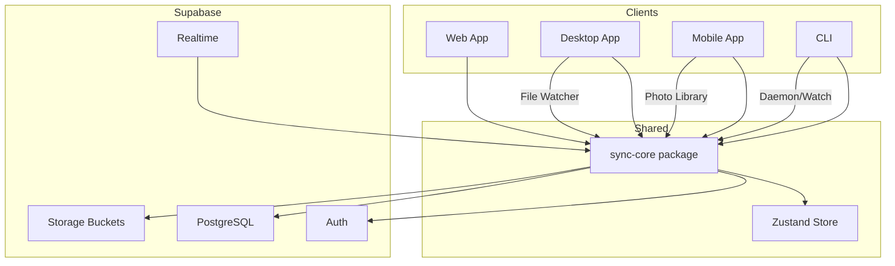
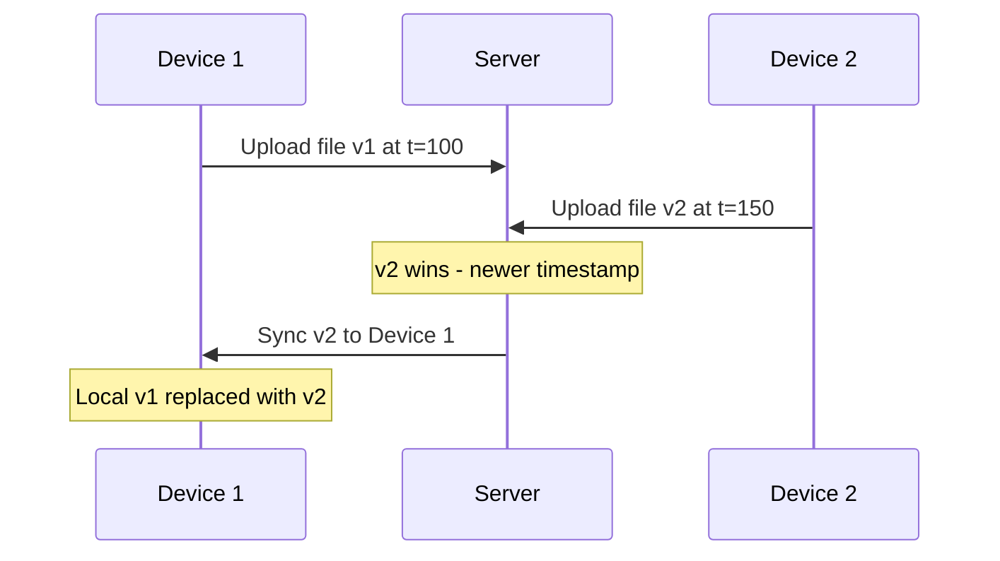
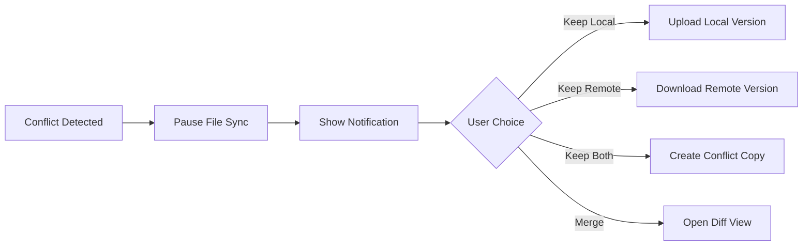

# Kynfi Monorepo Architecture Plan

## Overview

**Kynfi** is a cross-platform file and photo sync service with:
- **Web App** - Next.js dashboard for managing files/photos
- **Desktop App** - Electron app with background sync daemon
- **Mobile App** - Expo app for photo/file export and upload
- **CLI** - Command-line tool for power users and automation

**Tech Stack:**
- **Monorepo**: pnpm workspaces + Turborepo
- **Backend**: Supabase (Auth, Database, Storage, Realtime)
- **State Management**: Zustand (shared across platforms)
- **Payments**: Stripe (cards) + CoinPayPortal (crypto)

---

## Monorepo Folder Structure

```
kynfi.com/
├── apps/
│   ├── web/                    # Next.js web application
│   ├── desktop/                # Electron desktop app
│   ├── mobile/                 # Expo mobile app
│   └── cli/                    # CLI tool for power users
│
├── packages/
│   ├── @kynfi/types/           # Shared TypeScript types
│   ├── @kynfi/utils/           # Shared utility functions
│   ├── @kynfi/sync-core/       # Core sync logic (platform-agnostic)
│   ├── @kynfi/crypto/          # End-to-end encryption (E2EE)
│   ├── @kynfi/ui/              # Shared UI components (React Native Web compatible)
│   ├── @kynfi/supabase/        # Supabase client & hooks
│   ├── @kynfi/payments/        # Stripe + CoinPayPortal integration
│   └── @kynfi/config/          # Shared configs (eslint, tsconfig, tailwind)
│
├── turbo.json                  # Turborepo configuration
├── pnpm-workspace.yaml         # pnpm workspace definition
├── package.json                # Root package.json
├── .env.example                # Environment variables template
└── README.md
```

---

## Package Details

### `@kynfi/types`
Shared TypeScript definitions:
```typescript
// User & Auth
interface User { id: string; email: string; plan: Plan; ... }
interface Session { ... }

// Files & Sync
interface SyncFile { id: string; path: string; hash: string; size: number; ... }
interface SyncFolder { id: string; path: string; files: SyncFile[]; ... }
interface SyncStatus { state: 'idle' | 'syncing' | 'paused' | 'error'; progress: number; }

// Photos
interface Photo { id: string; uri: string; metadata: PhotoMetadata; ... }
interface PhotoMetadata { taken_at: Date; location?: GeoLocation; ... }
```

### `@kynfi/sync-core`
Platform-agnostic sync engine:
- **Chunked uploads** - Large file support with resumable uploads
- **Delta sync** - Only sync changed portions
- **Conflict resolution** - Last-write-wins or manual merge
- **Queue management** - Prioritized upload/download queues
- **Offline support** - Queue operations when offline

### `@kynfi/supabase`
Supabase integration:
- Pre-configured client with auth
- React hooks: `useUser()`, `useFiles()`, `useSyncStatus()`
- Realtime subscriptions for sync status
- Storage helpers for file upload/download

### `@kynfi/ui`
Shared React components (React Native Web compatible):
- `<FileList />`, `<PhotoGrid />`, `<SyncStatusBar />`
- `<UploadProgress />`, `<StorageQuota />`
- Design tokens and theme

---

## App Architectures

### Web App (`apps/web`)
```
apps/web/
├── src/
│   ├── app/                    # Next.js App Router
│   │   ├── (auth)/             # Auth routes (login, signup)
│   │   ├── (dashboard)/        # Protected dashboard routes
│   │   │   ├── files/          # File browser
│   │   │   ├── photos/         # Photo gallery
│   │   │   ├── settings/       # User settings
│   │   │   └── billing/        # Stripe billing portal
│   │   └── api/                # API routes
│   │       ├── webhooks/       # Stripe & Supabase webhooks
│   │       └── sync/           # Sync status endpoints
│   ├── components/             # Web-specific components
│   ├── stores/                 # Zustand stores
│   └── lib/                    # Utilities
├── public/
├── next.config.js
└── package.json
```

**Key Features:**
- SSR/SSG for marketing pages
- Real-time file browser with drag-and-drop upload
- Photo gallery with lightbox
- Stripe Customer Portal integration

### Desktop App (`apps/desktop`)
```
apps/desktop/
├── src/
│   ├── main/                   # Electron main process
│   │   ├── index.ts            # Main entry
│   │   ├── sync-daemon.ts      # Background sync service
│   │   ├── file-watcher.ts     # File system watcher
│   │   ├── tray.ts             # System tray integration
│   │   └── ipc/                # IPC handlers
│   ├── renderer/               # Electron renderer (React)
│   │   ├── App.tsx
│   │   ├── pages/
│   │   └── components/
│   └── preload/                # Preload scripts
├── electron-builder.yml        # Build configuration
└── package.json
```

**Key Features:**
- **Sync Daemon** - Background process watching folders
- **System Tray** - Quick access to sync status
- **Selective Sync** - Choose which folders to sync
- **Bandwidth Control** - Limit upload/download speeds
- **Auto-launch** - Start on system boot

### Mobile App (`apps/mobile`)
```
apps/mobile/
├── src/
│   ├── app/                    # Expo Router
│   │   ├── (tabs)/             # Tab navigation
│   │   │   ├── photos.tsx      # Photo gallery
│   │   │   ├── files.tsx       # File browser
│   │   │   └── settings.tsx    # Settings
│   │   └── (auth)/             # Auth screens
│   ├── components/             # Mobile-specific components
│   ├── stores/                 # Zustand stores
│   ├── services/
│   │   ├── photo-export.ts     # Photo library access
│   │   └── background-upload.ts # Background upload service
│   └── lib/
├── app.json                    # Expo config
└── package.json
```

**Key Features:**
- **Photo Export** - Access device photo library
- **Background Upload** - Upload photos when app is backgrounded
- **Auto-backup** - Automatic photo backup option
- **Offline Queue** - Queue uploads when offline

### CLI App (`apps/cli`)
```
apps/cli/
├── src/
│   ├── index.ts                # Entry point
│   ├── commands/
│   │   ├── auth.ts             # login, logout, whoami
│   │   ├── sync.ts             # sync, watch, status
│   │   ├── files.ts            # ls, upload, download, rm, mv
│   │   ├── config.ts           # config get/set
│   │   └── daemon.ts           # daemon start/stop/status
│   ├── lib/
│   │   ├── config.ts           # Config file management
│   │   ├── output.ts           # Pretty printing, spinners
│   │   └── daemon.ts           # Daemon process management
│   └── utils/
├── bin/
│   └── kynfi                   # Executable entry
├── package.json
└── tsconfig.json
```

**CLI Commands:**
```bash
# Authentication
kynfi login                     # Interactive login
kynfi login --token <token>     # Login with API token
kynfi logout
kynfi whoami

# File Operations
kynfi ls [path]                 # List files
kynfi upload <local> [remote]   # Upload file or folder
kynfi download <remote> [local] # Download file or folder
kynfi rm <path>                 # Delete file
kynfi mv <src> <dest>           # Move/rename file

# Sync Operations
kynfi sync                      # One-time sync
kynfi watch [folder]            # Watch folder for changes
kynfi status                    # Show sync status

# Daemon (background sync)
kynfi daemon start              # Start background daemon
kynfi daemon stop               # Stop daemon
kynfi daemon status             # Check daemon status
kynfi daemon logs               # View daemon logs

# Configuration
kynfi config list               # List all config
kynfi config get <key>          # Get config value
kynfi config set <key> <value>  # Set config value
kynfi config path               # Show config file path
```

**Key Features:**
- **Commander.js** - CLI framework with subcommands
- **Ora** - Spinners for async operations
- **Chalk** - Colored output
- **Conf** - Config file management (~/.kynfi/config.json)
- **Daemon Mode** - Background sync process
- **Progress Bars** - Upload/download progress
- **Scriptable** - JSON output mode for automation

---

## Supabase Schema

```sql
-- Users (extends Supabase auth.users)
CREATE TABLE profiles (
  id UUID PRIMARY KEY REFERENCES auth.users(id),
  email TEXT NOT NULL,
  display_name TEXT,
  avatar_url TEXT,
  plan TEXT DEFAULT 'free',
  storage_used BIGINT DEFAULT 0,
  storage_limit BIGINT DEFAULT 5368709120, -- 5GB free
  stripe_customer_id TEXT,
  created_at TIMESTAMPTZ DEFAULT NOW(),
  updated_at TIMESTAMPTZ DEFAULT NOW()
);

-- Files metadata
CREATE TABLE files (
  id UUID PRIMARY KEY DEFAULT gen_random_uuid(),
  user_id UUID REFERENCES profiles(id) ON DELETE CASCADE,
  name TEXT NOT NULL,
  path TEXT NOT NULL,
  size BIGINT NOT NULL,
  mime_type TEXT,
  hash TEXT NOT NULL,
  storage_path TEXT NOT NULL,
  is_folder BOOLEAN DEFAULT FALSE,
  parent_id UUID REFERENCES files(id),
  created_at TIMESTAMPTZ DEFAULT NOW(),
  updated_at TIMESTAMPTZ DEFAULT NOW(),
  deleted_at TIMESTAMPTZ,
  UNIQUE(user_id, path)
);

-- Photos metadata
CREATE TABLE photos (
  id UUID PRIMARY KEY DEFAULT gen_random_uuid(),
  file_id UUID REFERENCES files(id) ON DELETE CASCADE,
  user_id UUID REFERENCES profiles(id) ON DELETE CASCADE,
  taken_at TIMESTAMPTZ,
  width INT,
  height INT,
  latitude DECIMAL,
  longitude DECIMAL,
  device_id TEXT,
  thumbnail_path TEXT,
  created_at TIMESTAMPTZ DEFAULT NOW()
);

-- Sync state per device
CREATE TABLE sync_devices (
  id UUID PRIMARY KEY DEFAULT gen_random_uuid(),
  user_id UUID REFERENCES profiles(id) ON DELETE CASCADE,
  device_name TEXT NOT NULL,
  device_type TEXT NOT NULL, -- 'desktop', 'mobile', 'web', 'cli'
  last_sync_at TIMESTAMPTZ,
  sync_cursor TEXT,
  created_at TIMESTAMPTZ DEFAULT NOW()
);

-- Indexes
CREATE INDEX idx_files_user_path ON files(user_id, path);
CREATE INDEX idx_files_parent ON files(parent_id);
CREATE INDEX idx_photos_user_taken ON photos(user_id, taken_at DESC);

-- File versions (for version history)
CREATE TABLE file_versions (
  id UUID PRIMARY KEY DEFAULT gen_random_uuid(),
  file_id UUID REFERENCES files(id) ON DELETE SET NULL,
  user_id UUID REFERENCES profiles(id) ON DELETE CASCADE,
  version_number INT NOT NULL,
  hash TEXT NOT NULL,
  size BIGINT NOT NULL,
  storage_path TEXT NOT NULL,
  change_type TEXT NOT NULL,  -- 'created', 'modified', 'renamed', 'restored'
  device_id UUID REFERENCES sync_devices(id),
  created_at TIMESTAMPTZ DEFAULT NOW(),
  expires_at TIMESTAMPTZ
);

-- Deleted files (trash)
CREATE TABLE deleted_files (
  id UUID PRIMARY KEY DEFAULT gen_random_uuid(),
  user_id UUID REFERENCES profiles(id) ON DELETE CASCADE,
  name TEXT NOT NULL,
  path TEXT NOT NULL,
  size BIGINT NOT NULL,
  last_version_id UUID REFERENCES file_versions(id),
  deleted_at TIMESTAMPTZ DEFAULT NOW(),
  expires_at TIMESTAMPTZ NOT NULL
);

CREATE INDEX idx_versions_file ON file_versions(file_id, version_number DESC);
CREATE INDEX idx_deleted_user ON deleted_files(user_id, deleted_at DESC);

-- Subscription plans
CREATE TABLE plans (
  id TEXT PRIMARY KEY,           -- 'free', 'pro', 'business', 'enterprise'
  name TEXT NOT NULL,
  price_monthly DECIMAL(10,2),
  price_annual DECIMAL(10,2),
  storage_limit BIGINT NOT NULL,
  version_retention_days INT NOT NULL,
  features JSONB
);

-- User subscriptions
CREATE TABLE subscriptions (
  id UUID PRIMARY KEY DEFAULT gen_random_uuid(),
  user_id UUID REFERENCES profiles(id) ON DELETE CASCADE,
  plan_id TEXT REFERENCES plans(id),
  status TEXT NOT NULL,          -- 'active', 'canceled', 'past_due', 'expired'
  payment_provider TEXT NOT NULL, -- 'stripe' or 'coinpayportal'
  provider_subscription_id TEXT,
  current_period_start TIMESTAMPTZ,
  current_period_end TIMESTAMPTZ,
  created_at TIMESTAMPTZ DEFAULT NOW()
);

-- Payment history
CREATE TABLE payments (
  id UUID PRIMARY KEY DEFAULT gen_random_uuid(),
  user_id UUID REFERENCES profiles(id) ON DELETE CASCADE,
  amount DECIMAL(10,2) NOT NULL,
  currency TEXT NOT NULL,
  status TEXT NOT NULL,          -- 'pending', 'completed', 'failed'
  payment_provider TEXT NOT NULL,
  provider_payment_id TEXT,
  crypto_currency TEXT,          -- For crypto payments: 'BTC', 'ETH', etc.
  crypto_amount DECIMAL(18,8),
  tx_hash TEXT,                  -- Blockchain transaction hash
  created_at TIMESTAMPTZ DEFAULT NOW()
);

CREATE INDEX idx_subscriptions_user ON subscriptions(user_id);
CREATE INDEX idx_payments_user ON payments(user_id, created_at DESC);

-- User encryption settings (E2EE)
CREATE TABLE user_encryption (
  user_id UUID PRIMARY KEY REFERENCES profiles(id) ON DELETE CASCADE,
  kdf_salt BYTEA NOT NULL,
  kdf_memory INT DEFAULT 65536,
  kdf_iterations INT DEFAULT 3,
  encrypted_kek BYTEA NOT NULL,
  kek_nonce BYTEA NOT NULL,
  recovery_key_hash TEXT,
  recovery_kek BYTEA,
  recovery_nonce BYTEA,
  encryption_enabled BOOLEAN DEFAULT FALSE,
  created_at TIMESTAMPTZ DEFAULT NOW()
);

-- Device keys for multi-device E2EE sync
CREATE TABLE device_keys (
  id UUID PRIMARY KEY DEFAULT gen_random_uuid(),
  user_id UUID REFERENCES profiles(id) ON DELETE CASCADE,
  device_id UUID REFERENCES sync_devices(id) ON DELETE CASCADE,
  public_key BYTEA NOT NULL,
  encrypted_kek BYTEA NOT NULL,
  kek_nonce BYTEA NOT NULL,
  authorized_at TIMESTAMPTZ DEFAULT NOW(),
  UNIQUE(user_id, device_id)
);

-- Add encryption columns to files table
-- ALTER TABLE files ADD COLUMN encrypted BOOLEAN DEFAULT FALSE;
-- ALTER TABLE files ADD COLUMN encrypted_key BYTEA;
-- ALTER TABLE files ADD COLUMN key_nonce BYTEA;
-- ALTER TABLE files ADD COLUMN file_nonce BYTEA;
```

> 📄 **See [Version History & File Snapshots](./version-history.md)** for detailed implementation of version tracking, retention policies, and trash/undelete functionality.

> 📄 **See [Payment Integration](./payments.md)** for Stripe and CoinPayPortal implementation details, checkout flows, and webhook handlers.

> 📄 **See [End-to-End Encryption](./encryption.md)** for E2EE implementation, key hierarchy, multi-device sync, and recovery flows.

---

## Sync Architecture



### Sync Flow
1. **Change Detection** - File watcher (desktop/CLI) or manual trigger (web/mobile)
2. **Hash Calculation** - Calculate file hash for deduplication
3. **Queue Addition** - Add to upload/download queue
4. **Chunked Transfer** - Upload/download in chunks with progress
5. **Metadata Update** - Update Supabase database
6. **Realtime Broadcast** - Notify other devices via Supabase Realtime

---

## Conflict Resolution Strategy

### Conflict Types

| Type | Description | Example |
|------|-------------|---------|
| **Edit-Edit** | Same file modified on multiple devices | User edits doc on laptop and phone offline |
| **Edit-Delete** | File edited on one device, deleted on another | User deletes file on web, edits on desktop |
| **Create-Create** | Same filename created on multiple devices | Two devices create `notes.txt` in same folder |
| **Move-Edit** | File moved on one device, edited on another | User renames folder on desktop, edits file inside on mobile |

### Resolution Strategies

#### 1. Last-Write-Wins (Default for most files)
```
Strategy: Most recent modification timestamp wins
Use case: General files where latest version is typically desired
```



#### 2. Keep Both (Conflict Files)
```
Strategy: Rename conflicting file with device/timestamp suffix
Use case: When data loss is unacceptable
```

**Naming Convention:**
```
original.docx
original (Conflict from MacBook on 2024-01-15).docx
original (Conflict from iPhone on 2024-01-15).docx
```

#### 3. Manual Resolution (User Choice)
```
Strategy: Pause sync, prompt user to choose
Use case: Critical files, user preference
```

**UI Flow:**


### Conflict Detection Algorithm

```typescript
interface SyncState {
  localHash: string;
  localModified: number;
  remoteHash: string;
  remoteModified: number;
  baseHash: string;      // Last known synced version
  baseModified: number;
}

function detectConflict(state: SyncState): ConflictType | null {
  const localChanged = state.localHash !== state.baseHash;
  const remoteChanged = state.remoteHash !== state.baseHash;
  
  if (localChanged && remoteChanged) {
    // Both changed since last sync = CONFLICT
    return 'edit-edit';
  }
  
  if (localChanged && !remoteChanged) {
    // Only local changed = safe to upload
    return null;
  }
  
  if (!localChanged && remoteChanged) {
    // Only remote changed = safe to download
    return null;
  }
  
  // Neither changed = in sync
  return null;
}
```

### Per-File-Type Strategies

| File Type | Default Strategy | Rationale |
|-----------|------------------|-----------|
| **Photos** (.jpg, .png) | Last-Write-Wins | Photos rarely edited, metadata updates common |
| **Videos** (.mp4, .mov) | Last-Write-Wins | Binary files, latest version preferred |
| **Text files** (.txt, .md) | 3-Way Merge | Auto-merge when possible, show conflicts otherwise |
| **Code files** (.js, .ts, .py) | 3-Way Merge | Auto-merge, developers resolve remaining conflicts |
| **Config files** (.json, .yaml) | 3-Way Merge | Structural merge with conflict detection |
| **Documents** (.docx, .pdf) | Keep Both | Binary formats, content loss unacceptable |
| **Database files** (.db, .sqlite) | Block Sync | Corruption risk too high |

> 📄 **See [Three-Way Merge Strategy](./three-way-merge.md)** for detailed implementation of the 3-way merge algorithm, supported file types, and merge UI components.

### Database Schema for Conflict Tracking

```sql
-- Track sync state per file per device
CREATE TABLE file_sync_state (
  id UUID PRIMARY KEY DEFAULT gen_random_uuid(),
  file_id UUID REFERENCES files(id) ON DELETE CASCADE,
  device_id UUID REFERENCES sync_devices(id) ON DELETE CASCADE,
  base_hash TEXT NOT NULL,           -- Hash at last successful sync
  base_modified TIMESTAMPTZ NOT NULL,
  local_hash TEXT,                   -- Current local hash (if known)
  local_modified TIMESTAMPTZ,
  sync_status TEXT DEFAULT 'synced', -- 'synced', 'pending', 'conflict'
  conflict_type TEXT,                -- 'edit-edit', 'edit-delete', etc.
  created_at TIMESTAMPTZ DEFAULT NOW(),
  updated_at TIMESTAMPTZ DEFAULT NOW(),
  UNIQUE(file_id, device_id)
);

-- Conflict resolution history (audit trail)
CREATE TABLE conflict_resolutions (
  id UUID PRIMARY KEY DEFAULT gen_random_uuid(),
  file_id UUID REFERENCES files(id),
  user_id UUID REFERENCES profiles(id),
  conflict_type TEXT NOT NULL,
  resolution TEXT NOT NULL,          -- 'keep-local', 'keep-remote', 'keep-both', 'merged'
  local_hash TEXT,
  remote_hash TEXT,
  resolved_at TIMESTAMPTZ DEFAULT NOW()
);
```

### User Settings for Conflict Handling

```typescript
type ConflictStrategy =
  | 'last-write-wins'  // Newest timestamp wins
  | 'keep-both'        // Create conflict copies
  | 'three-way-merge'  // Auto-merge text files
  | 'ask'              // Always prompt user
  | 'block';           // Prevent sync entirely

interface ConflictSettings {
  // Global default for text files
  defaultStrategy: ConflictStrategy;
  
  // Per-extension overrides
  extensionRules: {
    [ext: string]: ConflictStrategy;
  };
  
  // 3-way merge specific settings
  mergeSettings: {
    // What to do when auto-merge has conflicts
    onMergeConflict: 'show-ui' | 'keep-both' | 'keep-local' | 'keep-remote';
    // Show merge preview before applying
    previewBeforeApply: boolean;
    // Max file size for merge (larger files use keep-both)
    maxMergeFileSizeMB: number;
  };
  
  // Notification preferences
  notifyOnConflict: boolean;
  notifyOnAutoResolution: boolean;
  notifyOnSuccessfulMerge: boolean;
  
  // Conflict file cleanup
  autoDeleteConflictFilesAfterDays: number | null;
}

// Default settings
const defaultConflictSettings: ConflictSettings = {
  defaultStrategy: 'three-way-merge',
  extensionRules: {
    // Media - last write wins
    '.jpg': 'last-write-wins',
    '.png': 'last-write-wins',
    '.gif': 'last-write-wins',
    '.mp4': 'last-write-wins',
    '.mp3': 'last-write-wins',
    // Text/Code - 3-way merge
    '.txt': 'three-way-merge',
    '.md': 'three-way-merge',
    '.js': 'three-way-merge',
    '.ts': 'three-way-merge',
    '.json': 'three-way-merge',
    '.yaml': 'three-way-merge',
    '.css': 'three-way-merge',
    '.html': 'three-way-merge',
    // Binary documents - keep both
    '.docx': 'keep-both',
    '.xlsx': 'keep-both',
    '.pdf': 'keep-both',
    // Dangerous - block
    '.db': 'block',
    '.sqlite': 'block',
  },
  mergeSettings: {
    onMergeConflict: 'show-ui',
    previewBeforeApply: false,
    maxMergeFileSizeMB: 10,
  },
  notifyOnConflict: true,
  notifyOnAutoResolution: false,
  notifyOnSuccessfulMerge: true,
  autoDeleteConflictFilesAfterDays: 30,
};
```

### Edge Cases & Solutions

| Edge Case | Solution |
|-----------|----------|
| **Offline for weeks** | Full resync with conflict detection on reconnect |
| **Clock skew between devices** | Use server timestamp as source of truth, not local |
| **Large file conflicts** | Show file size/preview before resolution |
| **Folder rename + file edit** | Track by file ID, not path; resolve folder first |
| **Rapid successive edits** | Debounce sync (wait 2s after last change) |
| **Partial upload interrupted** | Resume from last chunk; don't create conflict |

---

## Configuration Files

### Root `package.json`
```json
{
  "name": "kynfi",
  "private": true,
  "scripts": {
    "dev": "turbo dev",
    "build": "turbo build",
    "lint": "turbo lint",
    "test": "turbo test",
    "clean": "turbo clean"
  },
  "devDependencies": {
    "turbo": "^2.0.0",
    "typescript": "^5.3.0"
  },
  "packageManager": "pnpm@8.15.0"
}
```

### `pnpm-workspace.yaml`
```yaml
packages:
  - 'apps/*'
  - 'packages/*'
```

### `turbo.json`
```json
{
  "$schema": "https://turbo.build/schema.json",
  "globalDependencies": [".env"],
  "tasks": {
    "build": {
      "dependsOn": ["^build"],
      "outputs": [".next/**", "dist/**", ".expo/**"]
    },
    "dev": {
      "cache": false,
      "persistent": true
    },
    "lint": {
      "dependsOn": ["^build"]
    },
    "test": {
      "dependsOn": ["^build"]
    },
    "clean": {
      "cache": false
    }
  }
}
```

---

## Implementation Order

1. **Phase 1: Foundation**
   - Initialize monorepo with pnpm + Turborepo
   - Create shared config package
   - Set up `@kynfi/types` with core interfaces
   - Set up `@kynfi/supabase` with client

2. **Phase 2: Web App MVP**
   - Scaffold Next.js app
   - Implement auth flow
   - Basic file upload/download
   - Payment integration (Stripe + CoinPayPortal)

3. **Phase 3: Sync Core**
   - Implement `@kynfi/sync-core`
   - Chunked uploads
   - Queue management
   - Conflict resolution

4. **Phase 4: Desktop App**
   - Scaffold Electron app
   - File watcher integration
   - Sync daemon
   - System tray

5. **Phase 5: Mobile App**
   - Scaffold Expo app
   - Photo library access
   - Background upload
   - Auto-backup

6. **Phase 6: CLI**
   - Scaffold CLI with Commander.js
   - Implement auth commands
   - File operations (ls, upload, download)
   - Daemon mode for background sync
   - npm publish setup for global install

---

## Next Steps

After approval, switch to **Code mode** to:
1. Initialize the monorepo structure
2. Create all package scaffolds
3. Set up shared configurations
4. Implement the foundation packages
