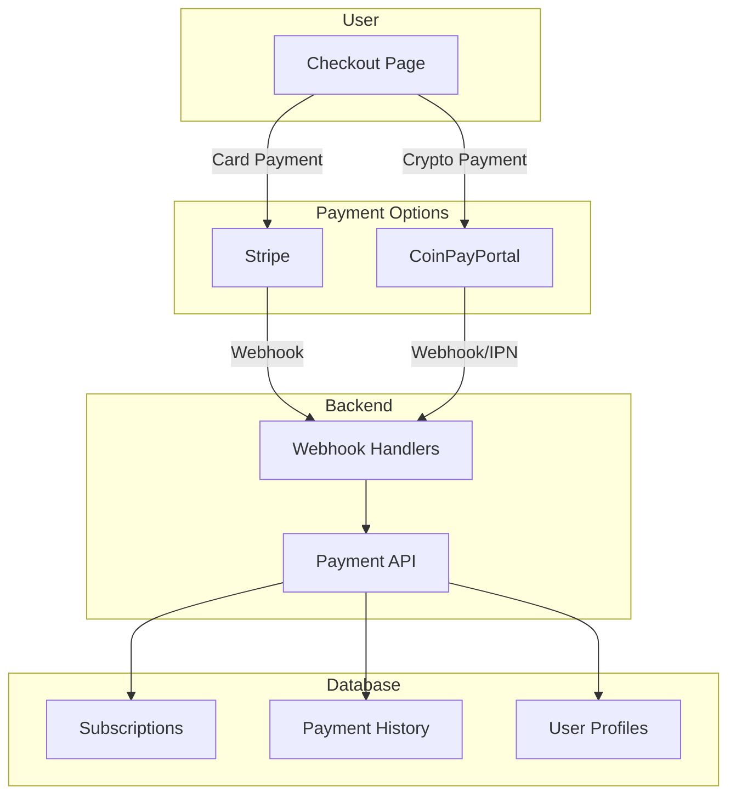

# Payment Integration for Kynfi

## Overview

Kynfi supports two payment gateways:
- **Stripe** - Credit/debit cards, Apple Pay, Google Pay
- **CoinPayPortal.com** - Cryptocurrency payments (BTC, ETH, USDT, etc.)

Users can choose their preferred payment method during checkout.

## Payment Architecture



## Pricing Plans

| Plan | Monthly | Annual | Features |
|------|---------|--------|----------|
| **Free** | $0 | $0 | 5 GB storage, 7-day version history |
| **Pro** | $9.99 | $99/yr | 100 GB storage, 30-day history, priority sync |
| **Business** | $19.99 | $199/yr | 1 TB storage, 90-day history, team features |
| **Enterprise** | Custom | Custom | Unlimited, 365-day history, SSO, dedicated support |

## Database Schema

```sql
-- Subscription plans
CREATE TABLE plans (
  id TEXT PRIMARY KEY,           -- 'free', 'pro', 'business', 'enterprise'
  name TEXT NOT NULL,
  price_monthly DECIMAL(10,2),
  price_annual DECIMAL(10,2),
  storage_limit BIGINT NOT NULL, -- Bytes
  version_retention_days INT NOT NULL,
  features JSONB,
  created_at TIMESTAMPTZ DEFAULT NOW()
);

-- User subscriptions
CREATE TABLE subscriptions (
  id UUID PRIMARY KEY DEFAULT gen_random_uuid(),
  user_id UUID REFERENCES profiles(id) ON DELETE CASCADE,
  plan_id TEXT REFERENCES plans(id),
  
  -- Status
  status TEXT NOT NULL,          -- 'active', 'canceled', 'past_due', 'trialing'
  
  -- Billing period
  current_period_start TIMESTAMPTZ,
  current_period_end TIMESTAMPTZ,
  cancel_at_period_end BOOLEAN DEFAULT FALSE,
  
  -- Payment provider info
  payment_provider TEXT NOT NULL, -- 'stripe' or 'coinpayportal'
  provider_subscription_id TEXT,  -- Stripe subscription ID or CoinPayPortal reference
  provider_customer_id TEXT,      -- Stripe customer ID or CoinPayPortal user ID
  
  -- Metadata
  created_at TIMESTAMPTZ DEFAULT NOW(),
  updated_at TIMESTAMPTZ DEFAULT NOW(),
  canceled_at TIMESTAMPTZ
);

-- Payment history
CREATE TABLE payments (
  id UUID PRIMARY KEY DEFAULT gen_random_uuid(),
  user_id UUID REFERENCES profiles(id) ON DELETE CASCADE,
  subscription_id UUID REFERENCES subscriptions(id),
  
  -- Payment details
  amount DECIMAL(10,2) NOT NULL,
  currency TEXT NOT NULL,        -- 'USD', 'BTC', 'ETH', 'USDT'
  status TEXT NOT NULL,          -- 'pending', 'completed', 'failed', 'refunded'
  
  -- Provider info
  payment_provider TEXT NOT NULL,
  provider_payment_id TEXT,      -- Stripe payment intent or CoinPayPortal transaction
  provider_fee DECIMAL(10,2),
  
  -- Crypto-specific
  crypto_amount DECIMAL(18,8),   -- Amount in crypto (e.g., 0.00234 BTC)
  crypto_currency TEXT,          -- 'BTC', 'ETH', 'USDT', etc.
  wallet_address TEXT,           -- Receiving wallet
  tx_hash TEXT,                  -- Blockchain transaction hash
  
  -- Timestamps
  created_at TIMESTAMPTZ DEFAULT NOW(),
  completed_at TIMESTAMPTZ
);

-- Indexes
CREATE INDEX idx_subscriptions_user ON subscriptions(user_id);
CREATE INDEX idx_subscriptions_provider ON subscriptions(payment_provider, provider_subscription_id);
CREATE INDEX idx_payments_user ON payments(user_id, created_at DESC);
```

## Stripe Integration

### Setup

```typescript
// packages/payments/src/stripe/client.ts

import Stripe from 'stripe';

export const stripe = new Stripe(process.env.STRIPE_SECRET_KEY!, {
  apiVersion: '2023-10-16',
});

// Product and Price IDs (create in Stripe Dashboard)
export const STRIPE_PRICES = {
  pro_monthly: 'price_xxx',
  pro_annual: 'price_xxx',
  business_monthly: 'price_xxx',
  business_annual: 'price_xxx',
};
```

### Checkout Flow

```typescript
// apps/web/src/app/api/checkout/stripe/route.ts

import { stripe, STRIPE_PRICES } from '@kynfi/payments';
import { createClient } from '@kynfi/supabase/server';

export async function POST(req: Request) {
  const { priceId, userId } = await req.json();
  const supabase = createClient();
  
  // Get or create Stripe customer
  const { data: profile } = await supabase
    .from('profiles')
    .select('stripe_customer_id, email')
    .eq('id', userId)
    .single();
  
  let customerId = profile.stripe_customer_id;
  
  if (!customerId) {
    const customer = await stripe.customers.create({
      email: profile.email,
      metadata: { kynfi_user_id: userId },
    });
    customerId = customer.id;
    
    await supabase
      .from('profiles')
      .update({ stripe_customer_id: customerId })
      .eq('id', userId);
  }
  
  // Create checkout session
  const session = await stripe.checkout.sessions.create({
    customer: customerId,
    mode: 'subscription',
    payment_method_types: ['card'],
    line_items: [{ price: priceId, quantity: 1 }],
    success_url: `${process.env.NEXT_PUBLIC_URL}/billing?success=true`,
    cancel_url: `${process.env.NEXT_PUBLIC_URL}/billing?canceled=true`,
    metadata: { kynfi_user_id: userId },
  });
  
  return Response.json({ url: session.url });
}
```

### Webhook Handler

```typescript
// apps/web/src/app/api/webhooks/stripe/route.ts

import { stripe } from '@kynfi/payments';
import { createClient } from '@kynfi/supabase/server';

export async function POST(req: Request) {
  const body = await req.text();
  const signature = req.headers.get('stripe-signature')!;
  
  let event: Stripe.Event;
  
  try {
    event = stripe.webhooks.constructEvent(
      body,
      signature,
      process.env.STRIPE_WEBHOOK_SECRET!
    );
  } catch (err) {
    return new Response('Webhook signature verification failed', { status: 400 });
  }
  
  const supabase = createClient();
  
  switch (event.type) {
    case 'checkout.session.completed': {
      const session = event.data.object as Stripe.Checkout.Session;
      await handleCheckoutComplete(supabase, session);
      break;
    }
    
    case 'customer.subscription.updated': {
      const subscription = event.data.object as Stripe.Subscription;
      await handleSubscriptionUpdate(supabase, subscription);
      break;
    }
    
    case 'customer.subscription.deleted': {
      const subscription = event.data.object as Stripe.Subscription;
      await handleSubscriptionCanceled(supabase, subscription);
      break;
    }
    
    case 'invoice.payment_succeeded': {
      const invoice = event.data.object as Stripe.Invoice;
      await handlePaymentSuccess(supabase, invoice);
      break;
    }
    
    case 'invoice.payment_failed': {
      const invoice = event.data.object as Stripe.Invoice;
      await handlePaymentFailed(supabase, invoice);
      break;
    }
  }
  
  return new Response('OK');
}

async function handleCheckoutComplete(supabase: any, session: Stripe.Checkout.Session) {
  const userId = session.metadata?.kynfi_user_id;
  const subscriptionId = session.subscription as string;
  
  const subscription = await stripe.subscriptions.retrieve(subscriptionId);
  const planId = getPlanFromPrice(subscription.items.data[0].price.id);
  
  await supabase.from('subscriptions').insert({
    user_id: userId,
    plan_id: planId,
    status: 'active',
    payment_provider: 'stripe',
    provider_subscription_id: subscriptionId,
    provider_customer_id: session.customer,
    current_period_start: new Date(subscription.current_period_start * 1000),
    current_period_end: new Date(subscription.current_period_end * 1000),
  });
  
  // Update user's plan
  await supabase
    .from('profiles')
    .update({ plan: planId })
    .eq('id', userId);
}
```

## CoinPayPortal Integration

### Overview

CoinPayPortal.com provides:
- Multiple cryptocurrency support (BTC, ETH, USDT, LTC, etc.)
- Instant Payment Notification (IPN) webhooks
- Automatic conversion to USD (optional)
- QR code generation for payments

### Setup

```typescript
// packages/payments/src/coinpayportal/client.ts

export interface CoinPayPortalConfig {
  apiKey: string;
  apiSecret: string;
  ipnSecret: string;
  merchantId: string;
}

export class CoinPayPortalClient {
  private baseUrl = 'https://api.coinpayportal.com/v1';
  
  constructor(private config: CoinPayPortalConfig) {}
  
  async createPayment(params: CreatePaymentParams): Promise<PaymentResponse> {
    const response = await fetch(`${this.baseUrl}/payments`, {
      method: 'POST',
      headers: {
        'Content-Type': 'application/json',
        'X-API-Key': this.config.apiKey,
        'X-API-Secret': this.config.apiSecret,
      },
      body: JSON.stringify({
        merchant_id: this.config.merchantId,
        amount: params.amount,
        currency: params.currency,        // 'USD'
        crypto_currency: params.crypto,   // 'BTC', 'ETH', 'USDT'
        description: params.description,
        callback_url: params.callbackUrl,
        success_url: params.successUrl,
        cancel_url: params.cancelUrl,
        metadata: params.metadata,
      }),
    });
    
    return response.json();
  }
  
  async getPaymentStatus(paymentId: string): Promise<PaymentStatus> {
    const response = await fetch(`${this.baseUrl}/payments/${paymentId}`, {
      headers: {
        'X-API-Key': this.config.apiKey,
        'X-API-Secret': this.config.apiSecret,
      },
    });
    
    return response.json();
  }
  
  verifyWebhook(payload: string, signature: string): boolean {
    const expectedSignature = crypto
      .createHmac('sha256', this.config.ipnSecret)
      .update(payload)
      .digest('hex');
    
    return crypto.timingSafeEqual(
      Buffer.from(signature),
      Buffer.from(expectedSignature)
    );
  }
}

export const coinPayPortal = new CoinPayPortalClient({
  apiKey: process.env.COINPAYPORTAL_API_KEY!,
  apiSecret: process.env.COINPAYPORTAL_API_SECRET!,
  ipnSecret: process.env.COINPAYPORTAL_IPN_SECRET!,
  merchantId: process.env.COINPAYPORTAL_MERCHANT_ID!,
});
```

### Checkout Flow

```typescript
// apps/web/src/app/api/checkout/crypto/route.ts

import { coinPayPortal } from '@kynfi/payments';
import { createClient } from '@kynfi/supabase/server';

export async function POST(req: Request) {
  const { planId, billingCycle, cryptoCurrency, userId } = await req.json();
  const supabase = createClient();
  
  // Get plan pricing
  const { data: plan } = await supabase
    .from('plans')
    .select('*')
    .eq('id', planId)
    .single();
  
  const amount = billingCycle === 'annual' 
    ? plan.price_annual 
    : plan.price_monthly;
  
  // Create crypto payment
  const payment = await coinPayPortal.createPayment({
    amount,
    currency: 'USD',
    crypto: cryptoCurrency,  // 'BTC', 'ETH', 'USDT'
    description: `Kynfi ${plan.name} - ${billingCycle}`,
    callbackUrl: `${process.env.NEXT_PUBLIC_URL}/api/webhooks/coinpayportal`,
    successUrl: `${process.env.NEXT_PUBLIC_URL}/billing?success=true&provider=crypto`,
    cancelUrl: `${process.env.NEXT_PUBLIC_URL}/billing?canceled=true`,
    metadata: {
      kynfi_user_id: userId,
      plan_id: planId,
      billing_cycle: billingCycle,
    },
  });
  
  // Store pending payment
  await supabase.from('payments').insert({
    user_id: userId,
    amount,
    currency: 'USD',
    status: 'pending',
    payment_provider: 'coinpayportal',
    provider_payment_id: payment.id,
    crypto_currency: cryptoCurrency,
    crypto_amount: payment.crypto_amount,
    wallet_address: payment.wallet_address,
  });
  
  return Response.json({
    paymentId: payment.id,
    walletAddress: payment.wallet_address,
    cryptoAmount: payment.crypto_amount,
    cryptoCurrency: cryptoCurrency,
    qrCode: payment.qr_code_url,
    expiresAt: payment.expires_at,
    checkoutUrl: payment.checkout_url,
  });
}
```

### Webhook Handler (IPN)

```typescript
// apps/web/src/app/api/webhooks/coinpayportal/route.ts

import { coinPayPortal } from '@kynfi/payments';
import { createClient } from '@kynfi/supabase/server';

export async function POST(req: Request) {
  const body = await req.text();
  const signature = req.headers.get('x-coinpayportal-signature')!;
  
  // Verify webhook signature
  if (!coinPayPortal.verifyWebhook(body, signature)) {
    return new Response('Invalid signature', { status: 400 });
  }
  
  const event = JSON.parse(body);
  const supabase = createClient();
  
  switch (event.type) {
    case 'payment.completed': {
      await handleCryptoPaymentComplete(supabase, event.data);
      break;
    }
    
    case 'payment.failed': {
      await handleCryptoPaymentFailed(supabase, event.data);
      break;
    }
    
    case 'payment.expired': {
      await handleCryptoPaymentExpired(supabase, event.data);
      break;
    }
  }
  
  return new Response('OK');
}

async function handleCryptoPaymentComplete(supabase: any, data: any) {
  const { payment_id, metadata, tx_hash } = data;
  
  // Update payment record
  await supabase
    .from('payments')
    .update({
      status: 'completed',
      tx_hash,
      completed_at: new Date(),
    })
    .eq('provider_payment_id', payment_id);
  
  // Create or update subscription
  const userId = metadata.kynfi_user_id;
  const planId = metadata.plan_id;
  const billingCycle = metadata.billing_cycle;
  
  const periodEnd = billingCycle === 'annual'
    ? new Date(Date.now() + 365 * 24 * 60 * 60 * 1000)
    : new Date(Date.now() + 30 * 24 * 60 * 60 * 1000);
  
  // Check for existing subscription
  const { data: existingSub } = await supabase
    .from('subscriptions')
    .select('id')
    .eq('user_id', userId)
    .eq('status', 'active')
    .single();
  
  if (existingSub) {
    // Extend existing subscription
    await supabase
      .from('subscriptions')
      .update({
        plan_id: planId,
        current_period_end: periodEnd,
        updated_at: new Date(),
      })
      .eq('id', existingSub.id);
  } else {
    // Create new subscription
    await supabase.from('subscriptions').insert({
      user_id: userId,
      plan_id: planId,
      status: 'active',
      payment_provider: 'coinpayportal',
      provider_payment_id: payment_id,
      current_period_start: new Date(),
      current_period_end: periodEnd,
    });
  }
  
  // Update user's plan
  await supabase
    .from('profiles')
    .update({ plan: planId })
    .eq('id', userId);
  
  // Send confirmation email
  await sendPaymentConfirmationEmail(userId, planId);
}
```

## Checkout UI Component

```typescript
// apps/web/src/components/checkout/PaymentMethodSelector.tsx

interface PaymentMethodSelectorProps {
  planId: string;
  billingCycle: 'monthly' | 'annual';
  onSuccess: () => void;
}

export function PaymentMethodSelector({ 
  planId, 
  billingCycle, 
  onSuccess 
}: PaymentMethodSelectorProps) {
  const [method, setMethod] = useState<'card' | 'crypto'>('card');
  const [cryptoCurrency, setCryptoCurrency] = useState('BTC');
  const [loading, setLoading] = useState(false);
  
  const handleStripeCheckout = async () => {
    setLoading(true);
    const priceId = getStripePriceId(planId, billingCycle);
    
    const res = await fetch('/api/checkout/stripe', {
      method: 'POST',
      body: JSON.stringify({ priceId, userId: user.id }),
    });
    
    const { url } = await res.json();
    window.location.href = url;
  };
  
  const handleCryptoCheckout = async () => {
    setLoading(true);
    
    const res = await fetch('/api/checkout/crypto', {
      method: 'POST',
      body: JSON.stringify({ 
        planId, 
        billingCycle, 
        cryptoCurrency,
        userId: user.id,
      }),
    });
    
    const data = await res.json();
    // Show crypto payment modal with QR code
    openCryptoPaymentModal(data);
  };
  
  return (
    <div className="space-y-4">
      {/* Payment Method Tabs */}
      <div className="flex gap-2">
        <button
          onClick={() => setMethod('card')}
          className={cn(
            'flex-1 p-4 rounded-lg border',
            method === 'card' ? 'border-blue-500 bg-blue-50' : 'border-gray-200'
          )}
        >
          <CreditCardIcon className="w-6 h-6" />
          <span>Card</span>
        </button>
        <button
          onClick={() => setMethod('crypto')}
          className={cn(
            'flex-1 p-4 rounded-lg border',
            method === 'crypto' ? 'border-blue-500 bg-blue-50' : 'border-gray-200'
          )}
        >
          <BitcoinIcon className="w-6 h-6" />
          <span>Crypto</span>
        </button>
      </div>
      
      {/* Crypto Currency Selector */}
      {method === 'crypto' && (
        <div className="grid grid-cols-4 gap-2">
          {['BTC', 'ETH', 'USDT', 'LTC'].map((crypto) => (
            <button
              key={crypto}
              onClick={() => setCryptoCurrency(crypto)}
              className={cn(
                'p-2 rounded border',
                cryptoCurrency === crypto ? 'border-blue-500' : 'border-gray-200'
              )}
            >
              <CryptoIcon currency={crypto} />
              <span>{crypto}</span>
            </button>
          ))}
        </div>
      )}
      
      {/* Checkout Button */}
      <button
        onClick={method === 'card' ? handleStripeCheckout : handleCryptoCheckout}
        disabled={loading}
        className="w-full py-3 bg-blue-600 text-white rounded-lg"
      >
        {loading ? 'Processing...' : `Pay with ${method === 'card' ? 'Card' : cryptoCurrency}`}
      </button>
    </div>
  );
}
```

## Crypto Payment Modal

```typescript
// apps/web/src/components/checkout/CryptoPaymentModal.tsx

interface CryptoPaymentModalProps {
  paymentId: string;
  walletAddress: string;
  cryptoAmount: string;
  cryptoCurrency: string;
  qrCode: string;
  expiresAt: string;
  onComplete: () => void;
  onCancel: () => void;
}

export function CryptoPaymentModal({
  paymentId,
  walletAddress,
  cryptoAmount,
  cryptoCurrency,
  qrCode,
  expiresAt,
  onComplete,
  onCancel,
}: CryptoPaymentModalProps) {
  const [status, setStatus] = useState<'pending' | 'confirming' | 'complete'>('pending');
  const [timeLeft, setTimeLeft] = useState(calculateTimeLeft(expiresAt));
  
  // Poll for payment status
  useEffect(() => {
    const interval = setInterval(async () => {
      const res = await fetch(`/api/payments/${paymentId}/status`);
      const { status: paymentStatus } = await res.json();
      
      if (paymentStatus === 'confirming') {
        setStatus('confirming');
      } else if (paymentStatus === 'completed') {
        setStatus('complete');
        onComplete();
      }
    }, 5000);
    
    return () => clearInterval(interval);
  }, [paymentId]);
  
  // Countdown timer
  useEffect(() => {
    const interval = setInterval(() => {
      setTimeLeft(calculateTimeLeft(expiresAt));
    }, 1000);
    
    return () => clearInterval(interval);
  }, [expiresAt]);
  
  return (
    <Dialog open onClose={onCancel}>
      <div className="p-6 space-y-4">
        <h2 className="text-xl font-bold">
          Pay {cryptoAmount} {cryptoCurrency}
        </h2>
        
        {/* QR Code */}
        <div className="flex justify-center">
          
        </div>
        
        {/* Wallet Address */}
        <div className="space-y-2">
          <label className="text-sm text-gray-500">Send to this address:</label>
          <div className="flex items-center gap-2 p-3 bg-gray-100 rounded">
            <code className="flex-1 text-sm break-all">{walletAddress}</code>
            <button onClick={() => copyToClipboard(walletAddress)}>
              <CopyIcon className="w-5 h-5" />
            </button>
          </div>
        </div>
        
        {/* Amount */}
        <div className="flex items-center justify-between p-3 bg-gray-100 rounded">
          <span>Amount:</span>
          <span className="font-mono font-bold">
            {cryptoAmount} {cryptoCurrency}
          </span>
        </div>
        
        {/* Status */}
        <div className="flex items-center gap-2">
          {status === 'pending' && (
            <>
              <Spinner className="w-5 h-5" />
              <span>Waiting for payment...</span>
            </>
          )}
          {status === 'confirming' && (
            <>
              <Spinner className="w-5 h-5 text-yellow-500" />
              <span>Payment received, confirming...</span>
            </>
          )}
          {status === 'complete' && (
            <>
              <CheckIcon className="w-5 h-5 text-green-500" />
              <span>Payment complete!</span>
            </>
          )}
        </div>
        
        {/* Timer */}
        {status === 'pending' && (
          <div className="text-center text-sm text-gray-500">
            Payment expires in: {timeLeft}
          </div>
        )}
        
        <button onClick={onCancel} className="w-full py-2 border rounded">
          Cancel
        </button>
      </div>
    </Dialog>
  );
}
```

## Subscription Management

### Billing Portal

```typescript
// apps/web/src/app/(dashboard)/billing/page.tsx

export default async function BillingPage() {
  const supabase = createClient();
  const { data: { user } } = await supabase.auth.getUser();
  
  const { data: subscription } = await supabase
    .from('subscriptions')
    .select('*, plans(*)')
    .eq('user_id', user.id)
    .eq('status', 'active')
    .single();
  
  const { data: payments } = await supabase
    .from('payments')
    .select('*')
    .eq('user_id', user.id)
    .order('created_at', { ascending: false })
    .limit(10);
  
  return (
    <div className="space-y-8">
      {/* Current Plan */}
      <section>
        <h2>Current Plan</h2>
        <PlanCard plan={subscription?.plans} />
        {subscription?.payment_provider === 'stripe' && (
          <StripePortalButton customerId={user.stripe_customer_id} />
        )}
      </section>
      
      {/* Upgrade Options */}
      <section>
        <h2>Upgrade</h2>
        <PlanSelector currentPlan={subscription?.plan_id} />
      </section>
      
      {/* Payment History */}
      <section>
        <h2>Payment History</h2>
        <PaymentHistoryTable payments={payments} />
      </section>
    </div>
  );
}
```

### Stripe Customer Portal

```typescript
// apps/web/src/app/api/billing/portal/route.ts

export async function POST(req: Request) {
  const { customerId } = await req.json();
  
  const session = await stripe.billingPortal.sessions.create({
    customer: customerId,
    return_url: `${process.env.NEXT_PUBLIC_URL}/billing`,
  });
  
  return Response.json({ url: session.url });
}
```

## Environment Variables

```bash
# .env.example

# Stripe
STRIPE_SECRET_KEY=sk_live_xxx
STRIPE_PUBLISHABLE_KEY=pk_live_xxx
STRIPE_WEBHOOK_SECRET=whsec_xxx

# CoinPayPortal
COINPAYPORTAL_API_KEY=xxx
COINPAYPORTAL_API_SECRET=xxx
COINPAYPORTAL_IPN_SECRET=xxx
COINPAYPORTAL_MERCHANT_ID=xxx
```

## Subscription Renewal (Crypto)

Since crypto payments don't auto-renew like Stripe subscriptions, we need to handle renewals:

```typescript
// Cron job: Check for expiring crypto subscriptions

async function checkExpiringSubscriptions() {
  const supabase = createClient();
  
  // Find subscriptions expiring in 7 days
  const sevenDaysFromNow = new Date(Date.now() + 7 * 24 * 60 * 60 * 1000);
  
  const { data: expiring } = await supabase
    .from('subscriptions')
    .select('*, profiles(email)')
    .eq('payment_provider', 'coinpayportal')
    .eq('status', 'active')
    .lt('current_period_end', sevenDaysFromNow.toISOString());
  
  for (const sub of expiring) {
    await sendRenewalReminderEmail(sub.profiles.email, sub);
  }
}

// Cron job: Downgrade expired subscriptions

async function downgradeExpiredSubscriptions() {
  const supabase = createClient();
  const now = new Date();
  
  const { data: expired } = await supabase
    .from('subscriptions')
    .select('*')
    .eq('status', 'active')
    .lt('current_period_end', now.toISOString());
  
  for (const sub of expired) {
    // Update subscription status
    await supabase
      .from('subscriptions')
      .update({ status: 'expired' })
      .eq('id', sub.id);
    
    // Downgrade user to free plan
    await supabase
      .from('profiles')
      .update({ plan: 'free' })
      .eq('id', sub.user_id);
    
    await sendSubscriptionExpiredEmail(sub.user_id);
  }
}
```

## Summary

| Feature | Stripe | CoinPayPortal |
|---------|--------|---------------|
| **Payment Types** | Card, Apple Pay, Google Pay | BTC, ETH, USDT, LTC, etc. |
| **Recurring** | ✅ Auto-renewal | ❌ Manual renewal |
| **Refunds** | ✅ Built-in | ⚠️ Manual process |
| **Customer Portal** | ✅ Hosted portal | ❌ Custom UI needed |
| **Webhooks** | ✅ Stripe webhooks | ✅ IPN callbacks |
| **Fees** | ~2.9% + $0.30 | ~1% (varies by crypto) |
