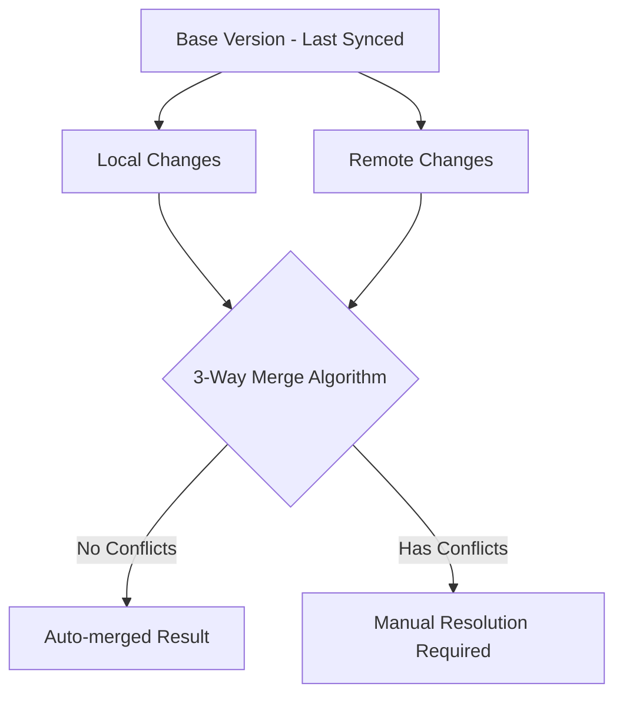

# Three-Way Merge Strategy for Kynfi

## Overview

Three-way merge is the gold standard for resolving conflicts in text files. It uses the **common ancestor** (base version) to intelligently merge changes from both sides.

## How 3-Way Merge Works



### The Three Versions

| Version | Description | Source |
|---------|-------------|--------|
| **Base** | Last successfully synced version | Stored in `file_sync_state.base_hash` |
| **Local** | Current version on this device | Local filesystem |
| **Remote** | Current version on server | Supabase Storage |

## Example Scenario

### Starting Point (Base - Last Synced)
```javascript
function greet() {
  return "Hello";
}

function farewell() {
  return "Goodbye";
}
```

### Local Changes (Your Device)
```javascript
function greet() {
  return "Hello World";  // Changed this line
}

function farewell() {
  return "Goodbye";      // Unchanged
}
```

### Remote Changes (Server)
```javascript
function greet() {
  return "Hello";        // Unchanged
}

function farewell() {
  return "Bye!";         // Changed this line
}
```

### Merged Result (Automatic!)
```javascript
function greet() {
  return "Hello World";  // From LOCAL (only local changed this)
}

function farewell() {
  return "Bye!";         // From REMOTE (only remote changed this)
}
```

**Why it works:** The algorithm compares each section to the base. If only one side changed, it takes that change. Conflict only occurs when **both sides changed the same section**.

## Conflict Markers

When auto-merge fails (both sides changed the same lines), we insert conflict markers:

```javascript
function getData() {
// <<<<<<< LOCAL
  return fetchFromCache();
// ||||||| BASE
  return fetchData();
// ======= 
  return fetchFromAPI();
// >>>>>>> REMOTE
}
```

The user must then choose which version to keep or manually edit.

## Implementation

### Using node-diff3 Library

```typescript
import { diff3Merge } from 'node-diff3';

interface MergeResult {
  success: boolean;
  merged: string | null;
  conflicts: ConflictRegion[];
}

interface ConflictRegion {
  startLine: number;
  endLine: number;
  local: string;
  base: string;
  remote: string;
}

async function threeWayMerge(
  localContent: string,
  baseContent: string,
  remoteContent: string
): Promise<MergeResult> {
  const result = diff3Merge(
    localContent.split('\n'),
    baseContent.split('\n'),
    remoteContent.split('\n')
  );
  
  const conflicts: ConflictRegion[] = [];
  const mergedLines: string[] = [];
  let currentLine = 1;
  
  for (const region of result) {
    if (region.ok) {
      // Clean merge - no conflict
      mergedLines.push(...region.ok);
      currentLine += region.ok.length;
    } else if (region.conflict) {
      // Conflict detected - record it
      conflicts.push({
        startLine: currentLine,
        endLine: currentLine + Math.max(
          region.conflict.a.length,
          region.conflict.o.length,
          region.conflict.b.length
        ),
        local: region.conflict.a.join('\n'),
        base: region.conflict.o.join('\n'),
        remote: region.conflict.b.join('\n'),
      });
      
      // Add conflict markers to output
      mergedLines.push('// <<<<<<< LOCAL');
      mergedLines.push(...region.conflict.a);
      mergedLines.push('// ||||||| BASE');
      mergedLines.push(...region.conflict.o);
      mergedLines.push('// =======');
      mergedLines.push(...region.conflict.b);
      mergedLines.push('// >>>>>>> REMOTE');
      
      currentLine += region.conflict.a.length + 5;
    }
  }
  
  return {
    success: conflicts.length === 0,
    merged: mergedLines.join('\n'),
    conflicts,
  };
}
```

### Storing Base Version

```sql
-- Add base_content column to track the actual content for merging
ALTER TABLE file_sync_state ADD COLUMN base_content_path TEXT;

-- Or store in Supabase Storage with versioning
-- Pattern: {user_id}/versions/{file_id}/{hash}
```

### Merge Service in sync-core

```typescript
// packages/sync-core/src/merge/index.ts

export class MergeService {
  async attemptMerge(fileId: string, deviceId: string): Promise<MergeResult> {
    // 1. Get the three versions
    const base = await this.getBaseVersion(fileId, deviceId);
    const local = await this.getLocalVersion(fileId);
    const remote = await this.getRemoteVersion(fileId);
    
    // 2. Check if file type supports merging
    if (!this.isMergeable(fileId)) {
      return { success: false, reason: 'binary-file' };
    }
    
    // 3. Attempt 3-way merge
    const result = await threeWayMerge(local, base, remote);
    
    if (result.success) {
      // 4a. Auto-merge succeeded - upload merged version
      await this.uploadMergedVersion(fileId, result.merged);
      await this.updateSyncState(fileId, deviceId, 'synced');
      return { success: true, merged: result.merged };
    } else {
      // 4b. Conflicts found - need user intervention
      await this.updateSyncState(fileId, deviceId, 'conflict');
      return { 
        success: false, 
        conflicts: result.conflicts,
        mergedWithMarkers: result.merged 
      };
    }
  }
  
  private isMergeable(fileId: string): boolean {
    const ext = this.getExtension(fileId);
    return MERGEABLE_EXTENSIONS.includes(ext);
  }
}

const MERGEABLE_EXTENSIONS = [
  '.txt', '.md', '.markdown',
  '.js', '.ts', '.jsx', '.tsx',
  '.json', '.yaml', '.yml',
  '.css', '.scss', '.less',
  '.html', '.xml', '.svg',
  '.py', '.rb', '.go', '.rs',
  '.java', '.kt', '.swift',
  '.c', '.cpp', '.h',
  '.sh', '.bash', '.zsh',
  '.env', '.gitignore',
];
```

## Merge UI Components

### Web/Desktop Merge View

```typescript
interface MergeViewProps {
  fileId: string;
  localContent: string;
  baseContent: string;
  remoteContent: string;
  conflicts: ConflictRegion[];
  onResolve: (resolvedContent: string) => void;
  onCancel: () => void;
}

// Features to implement:
// 1. Three-pane view: Local | Base | Remote
// 2. Two-pane view: Local | Remote (with base as reference)
// 3. Unified diff view with inline conflicts
// 4. Per-conflict resolution buttons:
//    - "Accept Local" 
//    - "Accept Remote"
//    - "Accept Both" (concatenate)
//    - "Edit Manually"
// 5. Syntax highlighting based on file type
// 6. Jump to next/previous conflict
// 7. Conflict counter: "Conflict 2 of 5"
// 8. Preview merged result
// 9. Keyboard shortcuts (Alt+L = accept local, Alt+R = accept remote)
```

### Mobile Merge View (Simplified)

On mobile, we show a simplified merge UI:
- Show conflict summary
- Options: "Keep My Version", "Keep Server Version", "Keep Both as Separate Files"
- Link to resolve on desktop/web for complex merges

## CLI Merge Commands

```bash
# Show what would be merged (dry run)
kynfi merge <file> --dry-run

# Attempt auto-merge
kynfi merge <file>
# Output: "Auto-merged successfully!" or "3 conflicts found"

# Interactive merge with $EDITOR
kynfi merge <file> --interactive
# Opens file with conflict markers in your editor

# Show 3-way diff
kynfi diff3 <file>
# Shows: LOCAL | BASE | REMOTE side by side

# Accept specific version for all conflicts
kynfi resolve <file> --accept local
kynfi resolve <file> --accept remote

# Mark as resolved after manual edit
kynfi resolve <file> --mark-resolved
```

## Supported File Types

| Category | Extensions | Merge Support |
|----------|------------|---------------|
| **Plain Text** | `.txt`, `.md`, `.rst` | ✅ Full 3-way merge |
| **JavaScript/TypeScript** | `.js`, `.ts`, `.jsx`, `.tsx`, `.mjs` | ✅ Full 3-way merge |
| **Web** | `.html`, `.css`, `.scss`, `.less` | ✅ Full 3-way merge |
| **Data** | `.json`, `.yaml`, `.yml`, `.toml`, `.xml` | ✅ Full 3-way merge |
| **Python** | `.py`, `.pyi` | ✅ Full 3-way merge |
| **Other Code** | `.go`, `.rs`, `.rb`, `.java`, `.kt`, `.swift` | ✅ Full 3-way merge |
| **Shell** | `.sh`, `.bash`, `.zsh`, `.fish` | ✅ Full 3-way merge |
| **Config** | `.env`, `.gitignore`, `.editorconfig` | ✅ Full 3-way merge |
| **Documents** | `.docx`, `.xlsx`, `.pdf` | ❌ Binary - Keep Both |
| **Images** | `.png`, `.jpg`, `.gif`, `.svg` | ❌ Binary - Last-Write-Wins |
| **Media** | `.mp4`, `.mp3`, `.wav` | ❌ Binary - Last-Write-Wins |
| **Database** | `.db`, `.sqlite` | ❌ Blocked from sync |

## Edge Cases

### 1. Base Version Not Available
If the base version is missing (e.g., first sync after install):
- Fall back to **two-way diff** (local vs remote)
- Show side-by-side comparison
- User must manually choose

### 2. Large Files
For files > 10MB:
- Show warning about merge time
- Offer to skip merge and use Keep Both
- Stream-based merge to avoid memory issues

### 3. Binary Files Detected as Text
Some files may have text extensions but contain binary:
- Detect binary content (null bytes, encoding issues)
- Fall back to Keep Both strategy

### 4. Encoding Differences
- Normalize to UTF-8 before merge
- Preserve original encoding on save
- Warn if encoding conversion loses data

## Integration with Conflict Settings

```typescript
// User can configure per-extension behavior
interface ConflictSettings {
  defaultStrategy: 'auto-merge' | 'keep-both' | 'ask';
  
  extensionRules: {
    // Override default for specific extensions
    '.json': 'auto-merge',      // Always try to merge JSON
    '.lock': 'last-write-wins', // Lock files shouldn't merge
    '.min.js': 'last-write-wins', // Minified files
  };
  
  // When auto-merge has conflicts
  onMergeConflict: 'show-ui' | 'keep-both' | 'keep-local' | 'keep-remote';
}
```

## Performance Considerations

1. **Lazy Loading**: Only load base version when conflict detected
2. **Caching**: Cache base versions locally for offline merge
3. **Streaming**: Use streaming diff for large files
4. **Background Merge**: Attempt auto-merge in background, notify on success/failure
