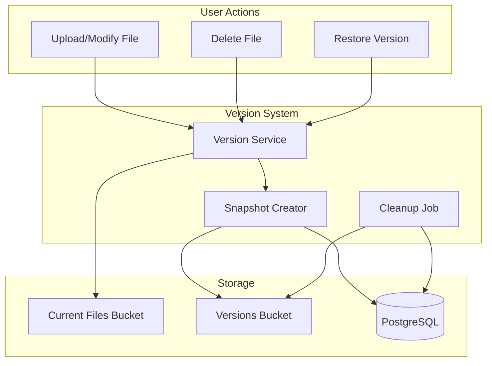
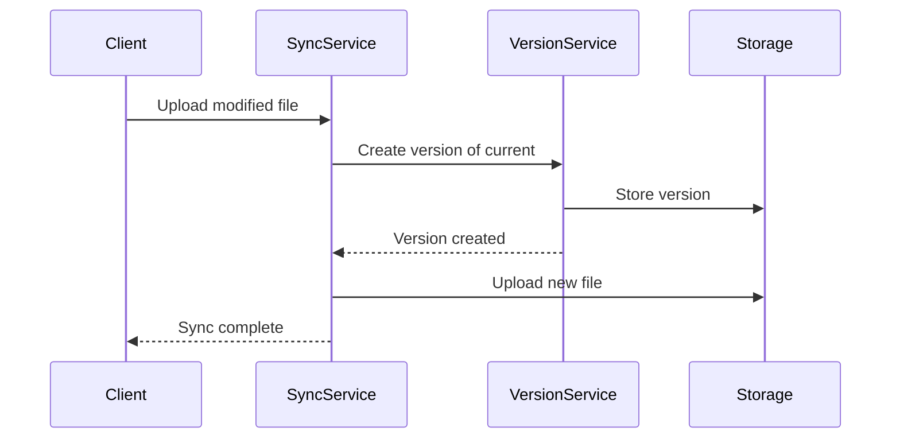

# Version History & File Snapshots for Kynfi

## Overview

Version history allows users to:
- **Recover deleted files** within a retention period
- **Restore previous versions** of modified files
- **View change history** with timestamps and device info
- **Compare versions** side-by-side
- **Undelete** accidentally removed files

## Architecture



## Database Schema

```sql
-- File versions table
CREATE TABLE file_versions (
  id UUID PRIMARY KEY DEFAULT gen_random_uuid(),
  file_id UUID REFERENCES files(id) ON DELETE SET NULL,
  user_id UUID REFERENCES profiles(id) ON DELETE CASCADE,
  
  -- Version metadata
  version_number INT NOT NULL,
  hash TEXT NOT NULL,
  size BIGINT NOT NULL,
  
  -- Storage location
  storage_path TEXT NOT NULL,  -- Path in versions bucket
  
  -- Change info
  change_type TEXT NOT NULL,   -- 'created', 'modified', 'renamed', 'moved', 'deleted'
  previous_path TEXT,          -- For rename/move tracking
  
  -- Device info
  device_id UUID REFERENCES sync_devices(id),
  device_name TEXT,
  
  -- Timestamps
  created_at TIMESTAMPTZ DEFAULT NOW(),
  
  -- Soft delete for cleanup
  expires_at TIMESTAMPTZ,      -- When this version will be deleted
  deleted_at TIMESTAMPTZ       -- Soft delete timestamp
);

-- Indexes for efficient queries
CREATE INDEX idx_versions_file ON file_versions(file_id, version_number DESC);
CREATE INDEX idx_versions_user ON file_versions(user_id, created_at DESC);
CREATE INDEX idx_versions_expires ON file_versions(expires_at) WHERE deleted_at IS NULL;
CREATE INDEX idx_versions_hash ON file_versions(hash);  -- For deduplication

-- Deleted files tracking (for undelete)
CREATE TABLE deleted_files (
  id UUID PRIMARY KEY DEFAULT gen_random_uuid(),
  original_file_id UUID,       -- Original file ID (may be reused)
  user_id UUID REFERENCES profiles(id) ON DELETE CASCADE,
  
  -- File info at deletion
  name TEXT NOT NULL,
  path TEXT NOT NULL,
  size BIGINT NOT NULL,
  mime_type TEXT,
  
  -- Last version reference
  last_version_id UUID REFERENCES file_versions(id),
  
  -- Deletion info
  deleted_at TIMESTAMPTZ DEFAULT NOW(),
  deleted_from_device TEXT,
  
  -- Retention
  expires_at TIMESTAMPTZ NOT NULL,  -- When permanently deleted
  restored_at TIMESTAMPTZ           -- If restored
);

CREATE INDEX idx_deleted_user ON deleted_files(user_id, deleted_at DESC);
CREATE INDEX idx_deleted_expires ON deleted_files(expires_at) WHERE restored_at IS NULL;
```

## Version Retention Policies

### By Plan Tier

| Plan | Version Retention | Deleted File Retention | Max Versions per File |
|------|-------------------|------------------------|----------------------|
| **Free** | 7 days | 7 days | 10 versions |
| **Pro** | 30 days | 30 days | 50 versions |
| **Business** | 90 days | 90 days | 100 versions |
| **Enterprise** | 365 days | 365 days | Unlimited |

### Configuration

```typescript
interface VersionRetentionPolicy {
  // How long to keep versions
  retentionDays: number;
  
  // How long to keep deleted files
  deletedFileRetentionDays: number;
  
  // Max versions per file (oldest pruned first)
  maxVersionsPerFile: number | null;
  
  // Minimum time between versions (debounce rapid saves)
  minVersionIntervalSeconds: number;
  
  // File size limits
  maxVersionedFileSizeMB: number;  // Files larger than this aren't versioned
  
  // Excluded patterns (never version these)
  excludePatterns: string[];
}

const defaultPolicies: Record<Plan, VersionRetentionPolicy> = {
  free: {
    retentionDays: 7,
    deletedFileRetentionDays: 7,
    maxVersionsPerFile: 10,
    minVersionIntervalSeconds: 60,
    maxVersionedFileSizeMB: 100,
    excludePatterns: ['node_modules/**', '.git/**', '*.log'],
  },
  pro: {
    retentionDays: 30,
    deletedFileRetentionDays: 30,
    maxVersionsPerFile: 50,
    minVersionIntervalSeconds: 30,
    maxVersionedFileSizeMB: 500,
    excludePatterns: ['node_modules/**', '.git/**'],
  },
  business: {
    retentionDays: 90,
    deletedFileRetentionDays: 90,
    maxVersionsPerFile: 100,
    minVersionIntervalSeconds: 10,
    maxVersionedFileSizeMB: 1000,
    excludePatterns: [],
  },
  enterprise: {
    retentionDays: 365,
    deletedFileRetentionDays: 365,
    maxVersionsPerFile: null,  // Unlimited
    minVersionIntervalSeconds: 0,
    maxVersionedFileSizeMB: 5000,
    excludePatterns: [],
  },
};
```

## Storage Strategy

### Supabase Storage Buckets

```
kynfi-storage/
├── files/                    # Current files
│   └── {user_id}/
│       └── {file_path}
│
├── versions/                 # Historical versions
│   └── {user_id}/
│       └── {file_id}/
│           └── {version_id}_{hash}
│
└── thumbnails/               # Image/video thumbnails
    └── {user_id}/
        └── {file_id}_thumb
```

### Deduplication

Files with the same hash are stored only once:

```typescript
async function createVersion(
  fileId: string,
  content: Buffer,
  metadata: VersionMetadata
): Promise<FileVersion> {
  const hash = await calculateHash(content);
  
  // Check if this exact content already exists
  const existingVersion = await db.query(
    'SELECT storage_path FROM file_versions WHERE hash = $1 AND user_id = $2',
    [hash, metadata.userId]
  );
  
  let storagePath: string;
  
  if (existingVersion) {
    // Reuse existing storage - just create metadata entry
    storagePath = existingVersion.storage_path;
  } else {
    // Upload new content
    storagePath = `versions/${metadata.userId}/${fileId}/${metadata.versionId}_${hash}`;
    await storage.upload(storagePath, content);
  }
  
  // Create version record
  return db.insert('file_versions', {
    file_id: fileId,
    user_id: metadata.userId,
    version_number: metadata.versionNumber,
    hash,
    size: content.length,
    storage_path: storagePath,
    change_type: metadata.changeType,
    device_id: metadata.deviceId,
    expires_at: calculateExpiry(metadata.userId),
  });
}
```

## Version Service Implementation

```typescript
// packages/sync-core/src/versions/version-service.ts

export class VersionService {
  constructor(
    private db: Database,
    private storage: StorageClient,
    private config: VersionRetentionPolicy
  ) {}

  /**
   * Create a new version when file is modified
   */
  async createVersion(
    fileId: string,
    content: Buffer,
    changeType: ChangeType,
    deviceId: string
  ): Promise<FileVersion> {
    // Check if we should create a version (debounce)
    const lastVersion = await this.getLatestVersion(fileId);
    if (lastVersion && this.shouldDebounce(lastVersion)) {
      // Update existing version instead of creating new
      return this.updateVersion(lastVersion.id, content);
    }
    
    // Check version limit
    await this.pruneOldVersions(fileId);
    
    // Create new version
    const versionNumber = (lastVersion?.version_number ?? 0) + 1;
    return this.saveVersion(fileId, content, versionNumber, changeType, deviceId);
  }

  /**
   * Get version history for a file
   */
  async getVersionHistory(
    fileId: string,
    options: { limit?: number; offset?: number } = {}
  ): Promise<FileVersion[]> {
    return this.db.query(`
      SELECT * FROM file_versions
      WHERE file_id = $1 AND deleted_at IS NULL
      ORDER BY version_number DESC
      LIMIT $2 OFFSET $3
    `, [fileId, options.limit ?? 50, options.offset ?? 0]);
  }

  /**
   * Restore a specific version
   */
  async restoreVersion(versionId: string): Promise<void> {
    const version = await this.getVersion(versionId);
    if (!version) throw new Error('Version not found');
    
    // Download version content
    const content = await this.storage.download(version.storage_path);
    
    // Upload as current file
    const file = await this.db.query(
      'SELECT * FROM files WHERE id = $1',
      [version.file_id]
    );
    
    await this.storage.upload(file.storage_path, content);
    
    // Update file metadata
    await this.db.update('files', file.id, {
      hash: version.hash,
      size: version.size,
      updated_at: new Date(),
    });
    
    // Create a new version for the restore action
    await this.createVersion(
      version.file_id,
      content,
      'restored',
      'web'  // or current device
    );
  }

  /**
   * Soft delete a file (move to deleted_files)
   */
  async softDeleteFile(fileId: string, deviceId: string): Promise<void> {
    const file = await this.db.query('SELECT * FROM files WHERE id = $1', [fileId]);
    const lastVersion = await this.getLatestVersion(fileId);
    
    // Create deleted file record
    await this.db.insert('deleted_files', {
      original_file_id: fileId,
      user_id: file.user_id,
      name: file.name,
      path: file.path,
      size: file.size,
      mime_type: file.mime_type,
      last_version_id: lastVersion?.id,
      deleted_from_device: deviceId,
      expires_at: this.calculateDeletedExpiry(file.user_id),
    });
    
    // Soft delete the file
    await this.db.update('files', fileId, {
      deleted_at: new Date(),
    });
  }

  /**
   * Restore a deleted file
   */
  async restoreDeletedFile(deletedFileId: string): Promise<File> {
    const deletedFile = await this.db.query(
      'SELECT * FROM deleted_files WHERE id = $1',
      [deletedFileId]
    );
    
    if (!deletedFile) throw new Error('Deleted file not found');
    if (deletedFile.restored_at) throw new Error('File already restored');
    
    // Get the last version content
    const version = await this.getVersion(deletedFile.last_version_id);
    const content = await this.storage.download(version.storage_path);
    
    // Check if path is available
    let restorePath = deletedFile.path;
    if (await this.pathExists(deletedFile.user_id, restorePath)) {
      restorePath = this.generateUniquePath(restorePath);
    }
    
    // Create new file
    const newFile = await this.db.insert('files', {
      user_id: deletedFile.user_id,
      name: deletedFile.name,
      path: restorePath,
      size: deletedFile.size,
      mime_type: deletedFile.mime_type,
      hash: version.hash,
      storage_path: `files/${deletedFile.user_id}/${restorePath}`,
    });
    
    // Upload content
    await this.storage.upload(newFile.storage_path, content);
    
    // Mark as restored
    await this.db.update('deleted_files', deletedFileId, {
      restored_at: new Date(),
    });
    
    return newFile;
  }

  /**
   * Compare two versions
   */
  async compareVersions(
    versionId1: string,
    versionId2: string
  ): Promise<VersionDiff> {
    const [v1, v2] = await Promise.all([
      this.getVersionWithContent(versionId1),
      this.getVersionWithContent(versionId2),
    ]);
    
    // For text files, generate diff
    if (this.isTextFile(v1.mime_type)) {
      const diff = generateDiff(v1.content, v2.content);
      return { type: 'text', diff };
    }
    
    // For binary files, just return metadata comparison
    return {
      type: 'binary',
      v1: { size: v1.size, hash: v1.hash, created_at: v1.created_at },
      v2: { size: v2.size, hash: v2.hash, created_at: v2.created_at },
    };
  }

  /**
   * Cleanup job - run periodically
   */
  async cleanupExpiredVersions(): Promise<CleanupResult> {
    const now = new Date();
    
    // Find expired versions
    const expiredVersions = await this.db.query(`
      SELECT id, storage_path, hash FROM file_versions
      WHERE expires_at < $1 AND deleted_at IS NULL
    `, [now]);
    
    let deletedCount = 0;
    let freedBytes = 0;
    
    for (const version of expiredVersions) {
      // Check if hash is used by other versions
      const otherUses = await this.db.query(`
        SELECT COUNT(*) FROM file_versions
        WHERE hash = $1 AND id != $2 AND deleted_at IS NULL
      `, [version.hash, version.id]);
      
      if (otherUses.count === 0) {
        // Safe to delete from storage
        await this.storage.delete(version.storage_path);
        freedBytes += version.size;
      }
      
      // Soft delete the version record
      await this.db.update('file_versions', version.id, {
        deleted_at: now,
      });
      deletedCount++;
    }
    
    // Cleanup expired deleted files
    const expiredDeleted = await this.db.query(`
      SELECT id FROM deleted_files
      WHERE expires_at < $1 AND restored_at IS NULL
    `, [now]);
    
    for (const deleted of expiredDeleted) {
      await this.db.delete('deleted_files', deleted.id);
    }
    
    return { deletedCount, freedBytes };
  }
}
```

## UI Components

### Version History Panel (Web/Desktop)

```typescript
interface VersionHistoryProps {
  fileId: string;
  onRestore: (versionId: string) => void;
  onCompare: (v1: string, v2: string) => void;
  onDownload: (versionId: string) => void;
}

// Features:
// - Timeline view of all versions
// - Version metadata (date, device, change type)
// - Quick actions: Restore, Download, Compare
// - Diff view for text files
// - Preview for images
// - Bulk selection for comparison
```

### Deleted Files / Trash (Web/Desktop)

```typescript
interface TrashViewProps {
  onRestore: (deletedFileId: string) => void;
  onPermanentDelete: (deletedFileId: string) => void;
  onEmptyTrash: () => void;
}

// Features:
// - List of deleted files with expiry countdown
// - Original path shown
// - Restore to original location or choose new
// - Permanent delete option
// - Empty trash button
// - Search within trash
```

### Mobile Version History

Simplified view for mobile:
- List of versions with dates
- Tap to preview
- Swipe to restore
- No diff view (link to web for that)

## CLI Commands

```bash
# List version history
kynfi versions <file>
kynfi versions <file> --limit 20

# Show specific version details
kynfi versions <file> --version 5

# Restore a version
kynfi restore <file> --version 5
kynfi restore <file> --version 5 --to ./restored-file.txt

# Compare versions
kynfi diff <file> --v1 3 --v2 5

# Download a specific version
kynfi download <file> --version 3 --output ./old-version.txt

# List deleted files (trash)
kynfi trash
kynfi trash --path /documents/

# Restore from trash
kynfi undelete <file-path>
kynfi undelete <deleted-file-id>

# Empty trash
kynfi trash --empty
kynfi trash --empty --confirm
```

## API Endpoints

```typescript
// Version history endpoints
GET    /api/files/:fileId/versions
GET    /api/files/:fileId/versions/:versionId
POST   /api/files/:fileId/versions/:versionId/restore
GET    /api/files/:fileId/versions/:versionId/download
GET    /api/files/:fileId/versions/compare?v1=:id1&v2=:id2

// Trash endpoints
GET    /api/trash
POST   /api/trash/:deletedFileId/restore
DELETE /api/trash/:deletedFileId  // Permanent delete
DELETE /api/trash                 // Empty trash
```

## Storage Cost Considerations

### Estimating Version Storage

```typescript
// Rough estimate: versions add 20-50% to storage usage
// depending on file change frequency

function estimateVersionStorageCost(
  currentStorageGB: number,
  avgFileChangeFrequency: 'low' | 'medium' | 'high',
  retentionDays: number
): number {
  const multipliers = {
    low: 0.1,    // 10% overhead
    medium: 0.3, // 30% overhead
    high: 0.5,   // 50% overhead
  };
  
  const baseMultiplier = multipliers[avgFileChangeFrequency];
  const retentionMultiplier = retentionDays / 30; // Normalized to 30 days
  
  return currentStorageGB * baseMultiplier * retentionMultiplier;
}
```

### User Storage Quota

Version storage counts toward user quota:

```typescript
interface StorageUsage {
  currentFiles: number;      // Bytes in current files
  versions: number;          // Bytes in version history
  trash: number;             // Bytes in deleted files
  total: number;             // Sum of above
  limit: number;             // Plan limit
  percentUsed: number;
}

// Show breakdown in UI:
// "Storage: 4.2 GB / 10 GB (42%)"
// "  - Current files: 3.5 GB"
// "  - Version history: 0.5 GB"
// "  - Trash: 0.2 GB"
```

## Edge Cases

| Scenario | Handling |
|----------|----------|
| **File renamed** | Track as same file (by ID), record old path in version |
| **File moved** | Track as same file, record old path |
| **Rapid saves** | Debounce - update latest version instead of creating new |
| **Large file** | Skip versioning if > maxVersionedFileSizeMB |
| **Binary file** | Store full copy (no delta), limit versions more aggressively |
| **Restore to occupied path** | Generate unique name: `file (restored).txt` |
| **Version during conflict** | Create version before merge, mark as "pre-merge" |
| **Offline edits** | Create versions when back online with original timestamps |

## Integration with Sync



## Supabase Edge Function for Cleanup

```typescript
// supabase/functions/cleanup-versions/index.ts

import { serve } from 'https://deno.land/std@0.168.0/http/server.ts';
import { createClient } from '@supabase/supabase-js';

serve(async (req) => {
  // This runs on a schedule (e.g., daily via cron)
  const supabase = createClient(
    Deno.env.get('SUPABASE_URL')!,
    Deno.env.get('SUPABASE_SERVICE_ROLE_KEY')!
  );
  
  const versionService = new VersionService(supabase);
  const result = await versionService.cleanupExpiredVersions();
  
  return new Response(JSON.stringify(result), {
    headers: { 'Content-Type': 'application/json' },
  });
});
```

## Summary

Version history provides:
- ✅ **Recovery** - Restore any previous version
- ✅ **Undelete** - Recover deleted files within retention period
- ✅ **Audit trail** - See who changed what and when
- ✅ **Comparison** - Diff between any two versions
- ✅ **Deduplication** - Same content stored once
- ✅ **Tiered retention** - More history for paid plans
- ✅ **Storage efficiency** - Automatic cleanup of old versions
